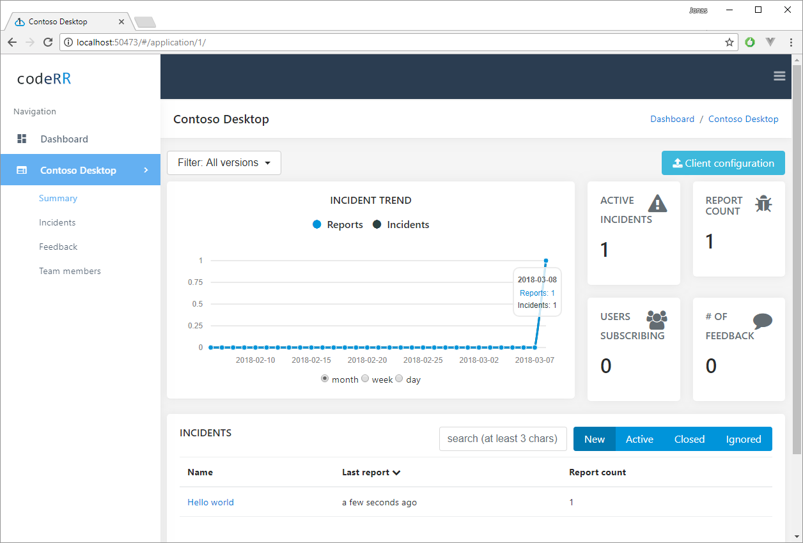
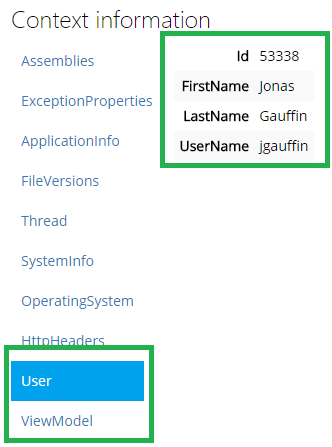

Getting started
================

# Presequites

If you have not done it yet, you can download one of our libraries from [nuget](https://www.nuget.org/packages?q=onetrueerror.client).

You need to either use our [hosted service](https://app.onetrueerror.com) or [install](../server/installation.md) the open source server. Unsure of which one you should use? Check our [edition comparison](https://onetrueerror.com/editions/compare).

## Using the client library

The first thing you need to do is to tell where the uploads should be sent and which application the reports are for.
The URL should either point on your local server installation or `https://report.onetrueerror.com`. The appKey and sharedSecret can be found in your OneTrueError account.

Once the above steps are completed you can configure the library like this:

```csharp
var url = new Uri("http://yourServer/onetrueerror/");
OneTrue.Configuration.Credentials(url, "yourAppKey", "yourSharedSecret");
```

The easiest way to report an exception is like this:

```csharp
try
{
    somelogic();
}
catch(SomeException ex)
{
	OneTrue.Report(ex);
}
```

The exception should appear in your server installation shortly after being reported.



### Automation

Automated exception handling is used by the framework specific activation method (depends on which nuget package you installed). 

Examples:

* `OneTrue.Configration.CatchWinFormsExceptions();`
* `OneTrue.Configration.CatchWinApiExceptions();`
* `OneTrue.Configration.CatchMvcExceptions();`
* `OneTrue.Configration.CatchAdoNetExceptions();`


## Attaching context information

Usually an exception is not enough information alone to be able to understand why and how the exception was thrown. OneTrueError will
always collect a large number of parameters for you. You might however have information that directly allows you to understand
why the exception was thrown.

That information can be attached when reporting:

```csharp
try
{
    //some stuff that generates an exception
}
catch (Exception ex)
{
    OneTrue.Report(ex, yourContextData);
}
```

### Using anonymous object

If you need to attach multiple values you can use an anonymous object:

```csharp
try
{
    //some stuff that generates an exception
}
catch (Exception ex)
{
    OneTrue.Report(ex, new { UserId = userId, UserState = state });
}
```

**Result**


### Custom collections

We also have an object overload which can transform any object into a context collection (one of the groups in the "Context Data" menu in our web site).

Below we are using `ToContextCollection()` extension method which can transform any object (including complex objects) into a context collection.


```csharp
try
{
    //some stuff that generates an exception
}
catch (Exception ex)
{
    var modelCollection = viewModel.ToContextCollection("ViewModel");
    var loggedInUser = User.ToContextCollection("User");
    OneTrue.Report(ex, new[]{modelCollection, loggedInUser});
}
```

**Result**



Hence you can easily attach and group your information just as you like.

## Categorize exceptions using tags

We automatically identify common StackOverflow.com tags when analyzing exceptions (to help you find answers by searching StackOverflow.com). You can
also add your own tags by adding a special property to any context collection named "OneTrueTags":

```csharp
try
{
    //some stuff that generates an exception
}
catch (Exception ex)
{
    OneTrue.Report(ex, new { OneTrueTags = "important,backend" });
}
```

**Result:**


# More information

Each nuget library has its own unique features. You can find the documentation on the [client start page](index.md).
