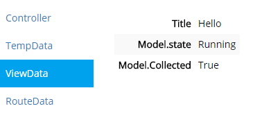

ASP.NET MVC 5 Integration
=========================

This client library will provide both ASP.NET and MVC specific context information for codeRR.


# Features

The library apart from detect and upload uncaughts exceptions also provide the following features.

## Error pages

The library have build in support for error pages. 

To use the ones included in the library, add the following in `global.asax` (after the `Err.Configuration.Credentials()` line):

```csharp
Err.Configuration.DisplayErrorPages();
```

### Custom error pages

If our built in pages are not preferable you can include your own views.

*Example*

```html
@model codeRR.Client.AspNet.Mvc5.CoderrViewModel

<h1>Internal Server Error</h1>
<p>
    We've experienced a malfunction in the core crystal cooling. The ship will explode within five seconds.
</p>

<h3>Reason</h3>
<p>
    @Model.Exception.Message
</p>
```

Views should be named as the HTTP codes are defined in the `HttpStatusCode` enum in .NET and be placed in the `Views/Errors` folder.


The `Error.cshtml` view is displayed if no other view matches.

### ErrorController

If it's enough to control the error handling through only views you can create your own `ErrorController`. 
Create it like any other controller in the Controllers folder.

The action methods should be name like the views. i.e. `public ActionResult InternalServer()`.

The information provided by codeRRs is represented as `CoderrViewModel`. Take it as a parameter to your action methods.

**Sample**

```
public class ErrorController : Controller
{
    public ActionResult Index(CoderrViewModel model)
    {
        return View("Error", model);
    }

    public ActionResult NotFound(CoderrViewModel model)
    {
        return View(model);
    }

    public ActionResult InternalServerError(CoderrViewModel model)
    {
        return View(model);
    }

}
```

### Custom formats

An error object will be returned if XML or JSON is requested by the HTTP client.

***json***

```javascript
{
  "error": { 
	"msg": "The error message", 
	"reportId": "Unique error id"
  }, 
  hint: "Use the report id when contacting us if you need further assistance." 
}
```

***xml***

```xml
<Error ReportId="Unique error id" hint="Use the report id when contacting us if you need further assistance">
	Error messgae
</Error>
```

## Context collections

To learn more about the included ASP.NET specifc context collections like HTTP Request, [read here](../index.md)


### Controller

The controller name is collected.

Example:


### RouteData

Information about the route that MVC took is collected.

Example:


### TempData

TempData is collected if set.

Example:

```csharp
TempData["DemoKey"] = new {
		Amount = 20000,
		Expires = DateTime.UtcNow.AddMinutes(5)
};
```

Result:


### ViewData / ViewBag

The Viewbag and/or ViewData is collected if specified.

Example:

```csharp
ViewBag.Title = "Hello";
ViewBag.Model = new
{
	state = "Running",
	Collected = true
};
```

Result:




# Links

* [ASP.NET MVC5 API reference](https://coderrapp.com/docs/api/client/aspnet/mvc5/)
* [Getting started guide](../../gettingstarted.md)
