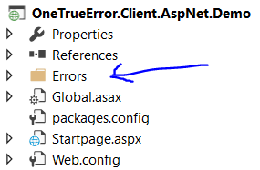

ASP.NET Integration
======================

This library is intended for ASP.NET projects that are not using MVC.

# Configuration

Read this [article](install.md).

# Context collections

These collections are generated by the ASP.NET library.

## HTTP headers

All HTTP headers in the request that the application could not handle.


## Uploaded files

Name, size and context type of all files that was uploaded in the request.

## Form

All items in the HTTP form (name and value)

## QueryString

Query string pairs (key and value).

## Session

All session items (support for complex objects)

# Customizations

This section describes how you can customize the built in features. You can also add your own [context providers](../../extending/contextprovider.md).

## Error pages

The library contains a custom error page which can be activated (and shown) when an exception is caught. 

To activate, add the following code:

```csharp
var provider = new VirtualPathProviderBasedGenerator("~/Errors/");
Err.Configuration.SetErrorPageGenerator(provider);
```

The code says that the library should look after error pages (either `.aspx` or  `.html`) in the specified folder:



The library tries to find pages based on the HTTP code. If the code is 404 the library tries to find the following error pages:

1. FileNotFound.aspx
2. FileNotFound.html
3. Error.aspx
4. Error.html

That is, it tries to find a specific file first. If a specific file does not exist, it tries to load a generic one.

### ASPX pages

To get information into your view, simply declare one of the following properties in your code behind.

| Property | Type | Description |
|------|----|----|
|ErrorContext | HttpErrorReporterContext | Look in the Client API specification for more information |
|Exception | *Exception* | The caught exception |

**Example**

```csharp
public partial class NotFound : System.Web.UI.Page
{
	protected void Page_Load(object sender, EventArgs e)
	{

	}

	public Exception Exception { get; set; }

	public HttpErrorReporterContext ErrorContext { get; set; }
}
```

Then simply display the error information in your HTML:

```csharp
<%@ Page Language="C#" AutoEventWireup="true" CodeBehind="NotFound.aspx.cs" Inherits="codeRR.Client.AspNet.Demo.Errors.NotFound" %>
<!DOCTYPE html>
<html xmlns="http://www.w3.org/1999/xhtml">
<head runat="server">
    <title>Failed to find <%= Exception.Message %></title>
</head>
<body>
	<form method="post" action="$URL$">
		<input type="hidden" value="$reportId$" name="reportId" />
        <div>
            Page is not found
        </div>
        <div>
            <%= ErrorContext.HttpStatusCode  %>
        </div>
		<div>
			<p>Could you please let us know how to reproduce it? Any information you	 give us will help us solve it faster.</p>
			<textarea rows="10" cols="40" name="Description"></textarea>
		</div>
    </form>
</body>
</html>
```

### HTML

If you are just using HTML you can use the following template strings:

| Template text | Description |
|------|----|----|
|`{ErrorMessage}` | Exception message |

**Example**

```html
<!DOCTYPE html>
<html lang="en">
<head>
    <meta charset="utf-8" />
    <title>An error occurred</title>
    <meta name="ROBOTS" content="NOINDEX, NOFOLLOW" />
    <meta name="X-powered-with" content="https://coderrapp.com" />
    <style type="text/css">
        /*CssStyles*/
    </style>
</head>
<body>
    <div style="" class="container">
        <div style="width: 100%; text-align: center">
            <h1>Looks like something went wrong!</h1>
        </div>
        <form method="post" action="$URL$">
            <div class="img">
                
            </div>
            <div class="content">
                <p>
                    Thanks for taking the time and letting us know about the issue.
                </p>
                <input type="hidden" value="$reportId$" name="reportId" />
                <div class="AllowSubmissionStyle">
                    <p>
                        If you allow us to collect additional error information we'll be able to analyze this error much faster.
                    </p>
                    <input type="checkbox" name="Allowed" value="true" checked="$AllowReportUploading$" />
                    I allow thy to collect the additional information.
                </div>
                <div class="AllowFeedbackStyle">
                    <p>Could you please let us know how to reproduce it? Any information you give us will help us solve it faster.</p>
                    <textarea rows="10" cols="40" name="Description"></textarea>
                </div>

                <div class="AskForEmailAddress">
                    <p>Enter your email address if you would like to receive status updates about this error.</p>
                    <input type="text" name="email" placeholder="email address" />
                </div>
                <hr />
                <input type="submit" value="Send report" />
                <a href="/">Back to homepage</a>
            </div>
            <div style="clear: both;"></div>
        </form>
    </div>
</body>
</html>
```

# Links

* [ASP.NET API reference](https://coderrapp.com/docs/api/client/aspnet/)
* [Getting started guide](../../gettingstarted.md)
