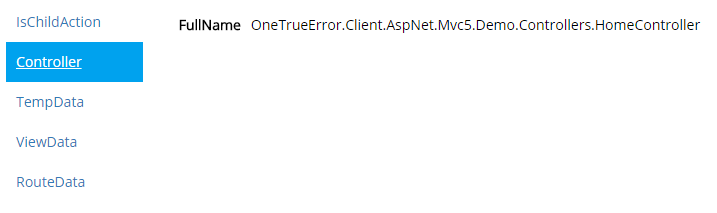
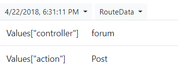
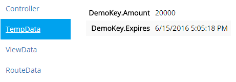

ASP.NET Core MVC
================

This client library will provide both ASP.NET and MVC specific context information for codeRR.


# Features

The library apart from detect and upload uncaught exceptions also provide the following features.

## Context collections

To learn more about the included ASP.NET specific context collections like HTTP Request, [read here](../index.md)


### Controller

The controller name is collected.

Example:



### RouteData

Information about the route that MVC took is collected.

Example:



### TempData

TempData is collected if set.

Example:

```csharp
TempData["DemoKey"] = new {
		Amount = 20000,
		Expires = DateTime.UtcNow.AddMinutes(5)
};
```

Result:



### ViewData / ViewBag

The ViewBag and/or ViewData is collected if specified.

Example:

```csharp
ViewBag.Title = "Hello";
ViewBag.Model = new
{
	state = "Running",
	Collected = true
};
```

Result:


# Links

* [ASP.NET MVC5 API reference](https://coderrapp.com/docs/api/client/aspnet/mvc5/)
* [Getting started guide](../../gettingstarted.md)
