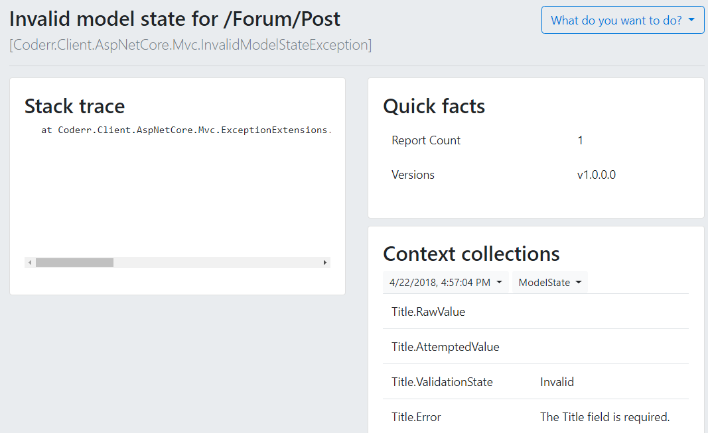
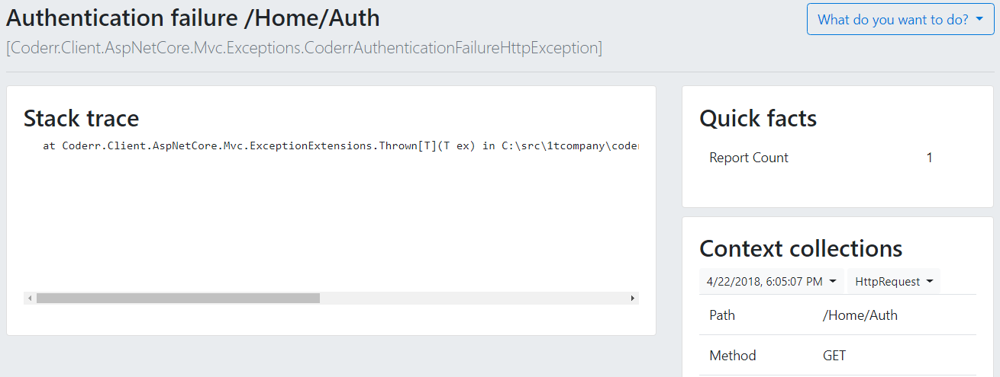
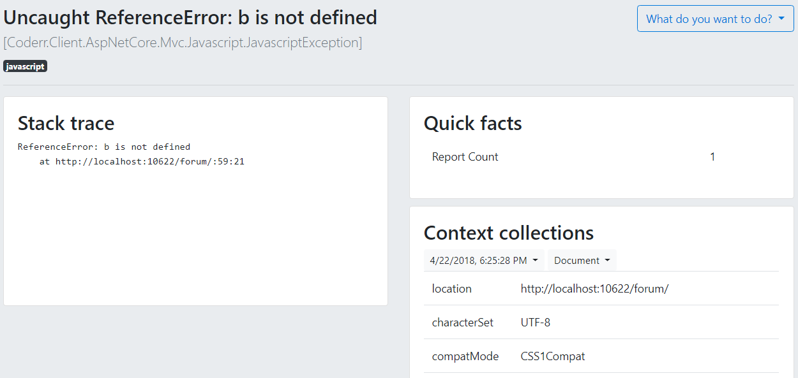
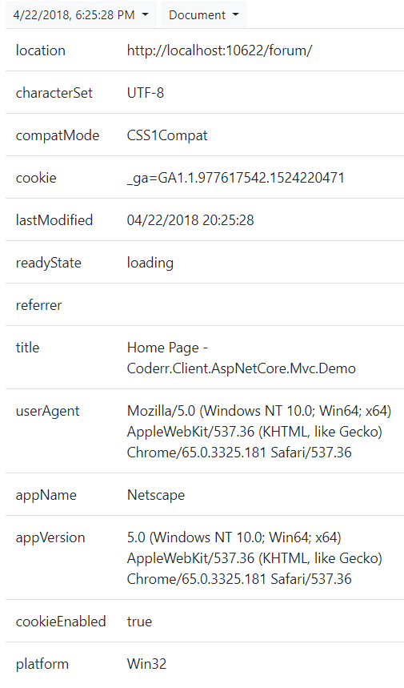
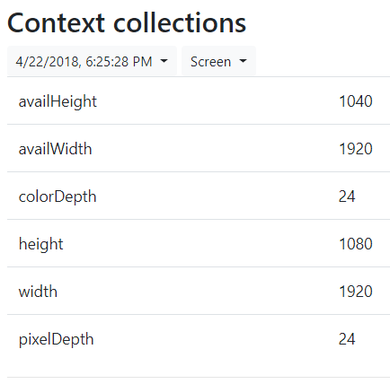

ASP.NET Core MVC
================

Our ASP.NET Core MVC integration reports all unhandled ASP.NET and MVC exceptions. It also reports if something goes too slow or if there are too many authentication failures. 

The [installation guide](./install/) provides instructions, configuration guidance and information on what nuget package to install.


# Configuration options

There are some additional configuration options to those above, that you can activate in Coderr. Below we show how to track invalid model states, track slow requests, track authentication failures, report javascript errors, do javascript context collections and understand the included context collections in Coderr and ASP.NET.

## Tracking invalid model states

Coderr reports all invalid model states, when activated.

Invalid model states is a good indication of the quality of your user interface for reporting errors. If many of the users fail to submit forms properly, it clearly shows that they either don't know what they should enter, the forms are unclear or a combination thereof.

To activate invalid model states, simply add:

```csharp
Err.Configuration.TrackInvalidModelStates();
```

You will now get one incident reported per invalid form as shown below.



The collection itself contains the fields that failed as this:


## Tracking slow requests

Slow requests decrease the overall user experience. Coderr allows you to set the threshold for how long a request may take.

This is useful if you want to ensure that the application is responsive enough, whilst not doing performance monitoring.

To set a timing threshold, add the following line with your timelimit:

```csharp
var maxTime = TimeSpan.FromMilliseconds(500);
Err.Configuration.TrackSlowRequests(maxTime);
```


## Tracking authentication failures

Coderr can track all failed authentication attempts. If activated, this feature will report all requests with the `Authorization` header when getting a 401 as a response. [Learn more about HTTP authentication](https://developer.mozilla.org/en-US/docs/Web/HTTP/Authentication).

To activate tracking authentication failures, use the following line:

```
Err.Configuration.TrackAuthenticationFailures();
```

The example below shows how authentication failures are reported:




## Reporting javascript errors

The ASP.NET Core MVC library can report javascript errors.Simply activate this feature, by including the built in script in your `_Layout.cshtml` like this:

```html
<script src="/coderr/js/"></script>
```

Now all unhandled javascript errors will be reported to Coderr, as follows:



### Javascript context collections

The following collections are included for Javascript errors.







## Included context collections in ASP.NET.

These collections are included for all ASP.NET Core MVC exceptions.

To learn more about the included ASP.NET specific context collections like HTTP Request, [read here](../aspnet/index.md). Below follows a series of context collections:

### ActionDescriptor

Information about the action and why it was selected.


### Form

Information supplied in the HTTP post.


### HttpRequest

Properties from the `HttpRequest` object in MVC.


### HttpRequestHeaders

ALL headers from the HTTP request.


### ModelState

Did we receive a valid model?


### TempData

TempData is collected if set.

Example:

```csharp
TempData["DemoKey"] = new {
		Amount = 20000,
		Expires = DateTime.UtcNow.AddMinutes(5)
};
```

Result:


### ViewData / ViewBag

The ViewBag and/or ViewData is collected if specified.

Example:

```csharp
ViewBag.Title = "Hello";
ViewBag.Model = new
{
	state = "Running",
	Collected = true
};
```

Result:


# Links

* [Reporting errors](../../)
