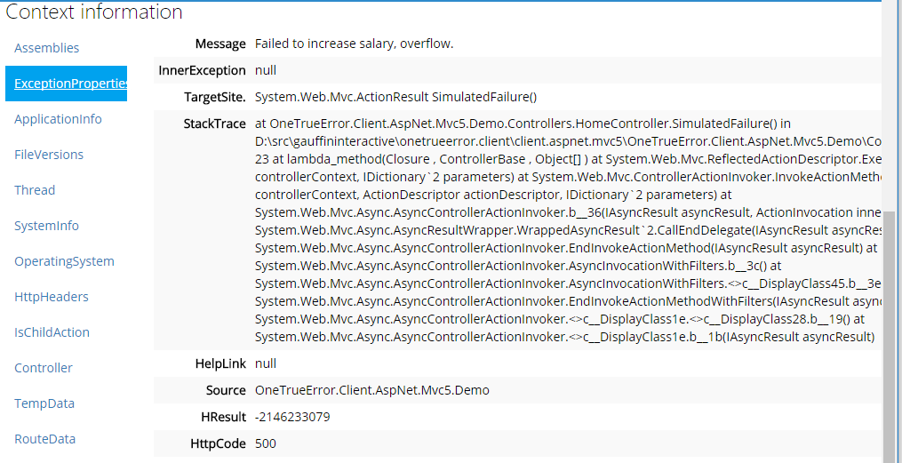

Getting started with the codeRR client library
=================================

This library is the foundation of all exception reporting done with codeRR. All other client libraries are based upon this one.

## Context collections

There are  few built in context collections in the core library. Some are added to the pipeline per default while others require you to add them manually.

### Application information

This collection includes information about your process. It contains information like used memory, thread count and ...

### Assemblies

All assemblies that have been loaded into the AppDomain.

### Exception information

Information from the exception, including all properties.

### File versions

File versions for all assemblies, as the assembly version might be the same while the file version is higher.

### Operating system

Operating system information

### System information

System information

### Thread information

Thread information like specified UI culture.

## More information

* [Client API reference](http://coderrapp.com/docs/api/client/)
* [Getting started guide](../../gettingstarted.md)
