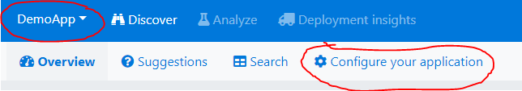

.NET 4.x - Core configuration instructions
===========================

Install the nuget package called `coderr.client`, if you haven't already.

Next, you need to tell the Coderr library what server it should upload all error reports to.

Please add the following code in your `Program.cs` (or the starting point of the framework that you use).

```csharp
var url = new Uri("http://yourServer/coderr/");
Err.Configuration.Credentials(url, 
                              "yourAppKey", 
                              "yourSharedSecret");
```

The appKey and the sharedSecret can be found in the Coderr server under the following menu option:



Select the correct application in the top left menu and then click on the "Configure your application" option.

Once configured, start your application and try manually to report an exception.

You can for example add the following code somewhere and then invoke your application:

```csharp
try
{
    throw new Exception("Hello world");
}
catch (Exception ex)
{
    Err.Report(ex, new { SampleData = "Context example"});
}
```

## More information

If you want more information, read the  [client documentation](index.md) or on error reporting [report errors](../../gettingstarted.md)
