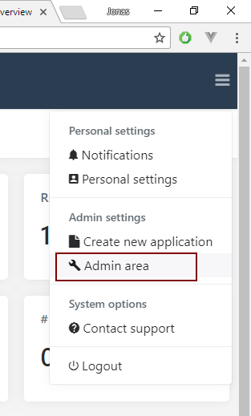
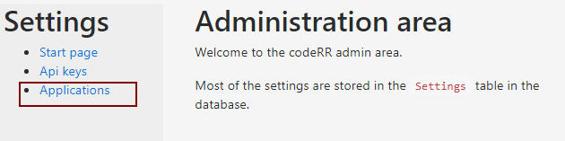
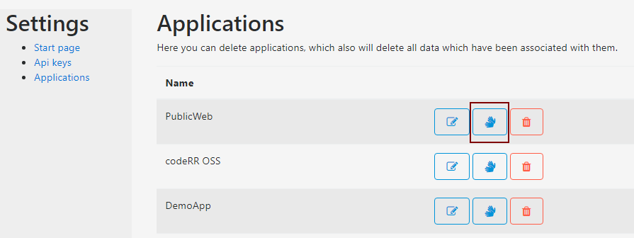
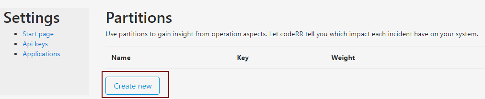
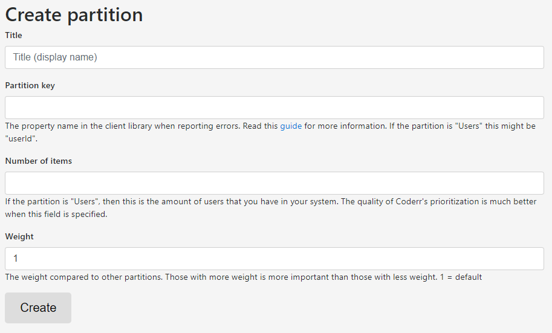

Partitions
===========

Partitions are used to segment incidents to be able to better prioritize which incidents to correct next.

A typical usage is to be able to tell the impact what each incident have on your system or users.


In the above example we have specified that we have ten users in the system and Coderr is therefore able to tell that this specific incident affect 20% of our users.

# Adding partitions to incidents

The minimal configuration is to attach partitions to each reported incident.

In the following example we want to prioritize errors based on how many installations and users that each incident affects.

To do that we add the following configuration to our code:

```csharp
Err.Configuration.AddPartition(context => 
{
  context.AddPartition("InstallId", ConfigurationManager.AppSetting["InstallId"]);
  context.AddPartition("UserName", Thread.CurrentPrincipal.Identity.Name);
});
```

That's everything required. Report an error to see the information under the reported incident. 

You can also go to "My incidents" in the left menu to see suggestions based on your configured partitions.

# Improving suggestions

***You need to be an administrator to be able to make this configuration.***

When you have completed the configuration above, Coderr have no knowledge about the number of installations or the number of users.

Therefore, prioritization of incidents are made upon the known total (i.e. based on all distinct values that we have received so far for all incidents).

If you would like to know see the impact based on the actual number of installations or users you need to go to the administration pages and specify those.

1. Click on the hamburger menu top right and choose "Administration area"<br>

2. Choose "Applications" in the left menu<br>
3. Select the hands icon for your application<br>
4. Click on "Create new"<br> 

Once there you should see the following page:



Configure the partition.

Now you should see the absolute impact in your system.
