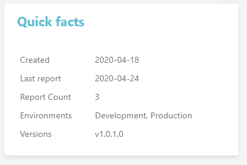
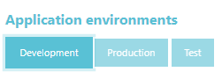
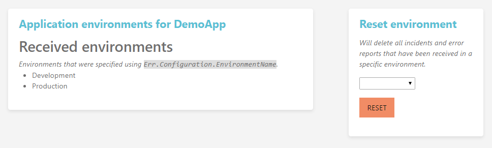

Environment tracking
====================

Having Coderr activated in all environments can generate a lot of errors which will be corrected without the help of Coderr.

We therefore allow you to track in which environment the errors have been detected in.

In that way you can delete all errors which have been found in a single environment.

You can also search for incidents in a specific environment:

# Resetting an environment

_To reset an environment you need to be administrator._

Click on the settings icon in the top right menu:

Select the correct application in the application menu (showing `(All applications)`) and then click on "Environments" in the submenu.

Once done, you will see this page:

Just select the correct environment in the right dropdown and click the "Reset" button.