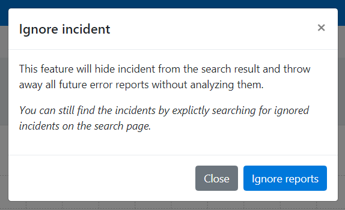

Ignore incidents
================

You typically ignore incidents when the error is acceptable in your system.

For instance if you receive 404 errors for pages that don't have to exist. Like `robots.txt` (typically 404 errors that search robots generate).

Ignore means that you will not get notified of new error reports and that the incident is not shown in the search per default.
You can still find ignored incidents using the search function.
