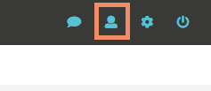
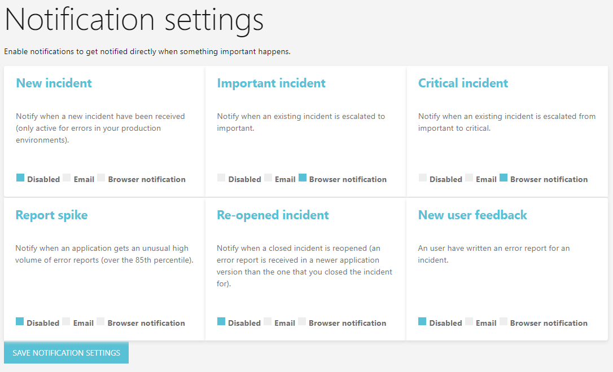

Incident notifications
====================

With incident notifications, you will get notified when different events occurr.

To get to the notifications, click on the user icon top right.

Now you should see the settings page.

Browser notifications allows you browser to create OS notifications like:

