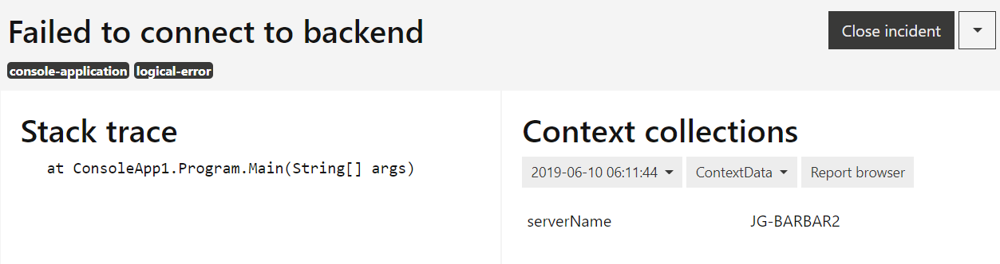
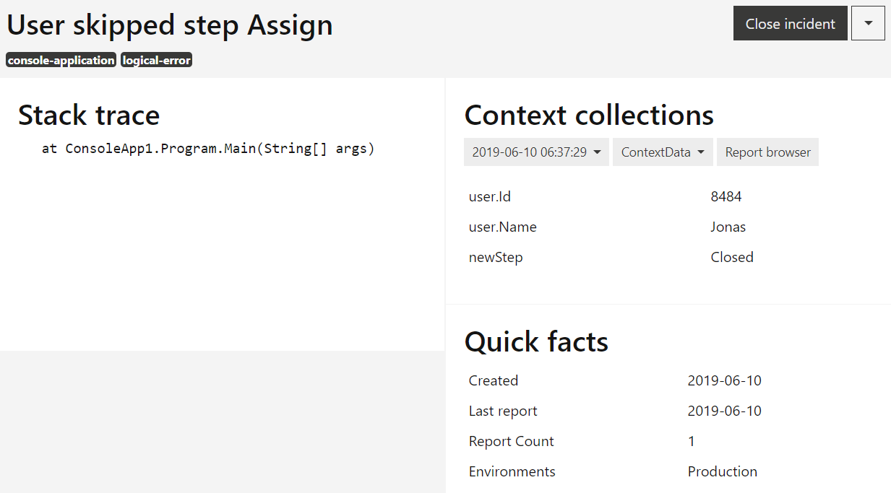

Logical errors
==============

Unlike exceptions, logical errors are errors that you can recover from but have to be corrected in future application versions. Coderr allows you to report logical errors to be able to take advantage of all analytical features in Coderr.

Generate a report by using the `Err.ReportLogicError` method.

# Example - Network communication

Let’s assume that the application have code that uses the network to communicate between the server and the clients. The company network is considered to respond in a timely fashion and to not drop packets. 

To be safe, as networks can have occasional problems, the application has code to handle those cases. As we expect that there can be network trouble, there is no need to throw exceptions. But we still want to get information when there is network trouble.

```csharp
Err.ReportLogicError(
    "Failed to connect to backend",
    new {serverName = Environment.MachineName});
```

Once Coderr have received the error, it will be shown as:




# Example 2 – User do not follow the designed flow

We've built an excellent todo application which prioritizes tasks based on the individual work pattern of each user. However, sometimes the user skips a few steps which mess up the todo algorithm. To learn what the user does to be able to improve the algorithm we want to record how often the user breaks the designed work flow.

The application can still recover from the alternative flow by adding data for the skipped steps. Thus it’s not an exception but also not an optimal usage of the application.

As in the previous example, use `ReportLogicalError`.

```csharp
Err.ReportLogicError("User skipped step " + stepName, new {user, newStep });
```	

As no exception is available, Coderr need to use something else to identify unique errors. In this case, it’s the message. But as the message varies, Coderr would generate duplicate errors. To mitigate that you can use a third parameter as error identifier:

```csharp
Err.ReportLogicError("User skipped step " + stepName, new {user, newStep }, "SkipStep" + stepName);
```

That’s fantastic since we now get an error per skipped step which also helps us see how often a certain step is skipped. It also allows us to report the same kind of logical error from different places in the code (just use the same identifier). 



When using the partitioning feature in Coderr Live and Coderr Premise we can also see the percentage of the users that skipped a specific step.

