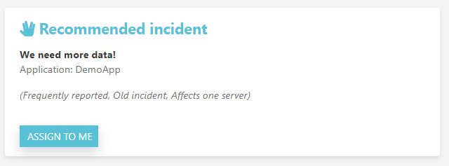
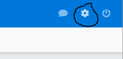
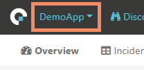
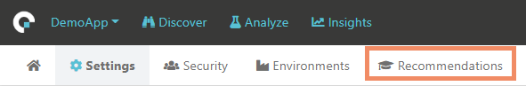
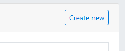
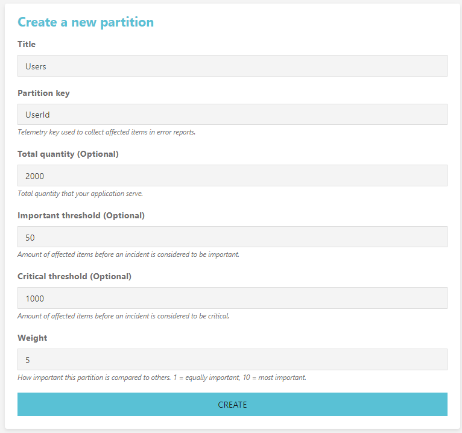

Recommendations
===============

Coderr can prioritize your incidents and recommend the one that have the largest impact on your business.




# Activating

To enable insights, use the `AddPartition` method in the client library to define it.

```csharp
Err.Configuration.AddPartition(context => 
{
  // See how many installations are affected
  context.AddPartition("InstallationId", ConfigurationManager.AppSetting["InstallationId"]);

  // See number of affected users
  context.AddPartition("UserId", Thread.CurrentPrincipal.Identity.Name);

  // See number of affected servers
  context.AddPartition("ServerId", Environment.MachineName);
});
```

The `context` parameter gives access to all collected data in the error report.

```csharp
Err.Configuration.AddPartition(context =>
{
    var collection = context
            .ReporterContext
            .ContextCollections
            .FirstOrDefault(x => x.Name == "LoggedInUser");
    if (collection != null)
    {
        var userId = collection.Properties["Id"];
        context.AddPartition("Users", userId);
    }
});
```

_(You can add [your own context collections](../../features/incidents/context-collections/) to every report)_

# Improving recommendations

***You need to be an administrator to be able to make this configuration.***

When you have completed the configuration above, Coderr have no knowledge about the number of installations or the number of users.

Therefore, prioritization of incidents are made upon the known total (i.e. based on all distinct values that we have received so far for all incidents).

If you would like to know see the impact based on the actual number of installations or users you need to go to the administration pages and specify those.

1. Click on the cog in the top right menu<br>
2. Make sure that the correct application is selected in the top left menu<br>
3. Click on prioritization in the menu<br>
4. Click on "Create new"<br> 

Fill in the information about your partition.

Here is a sample for users:



Once done, try to report an exception and then click on "Recommendations" under the "Discover" menu.

# Error escalation

Incidents in Coderr have three different escalation levels. Normal, Important and Critical.

* Normal incidents are priortized by getting points with the help of the above configured partitions
* Important incidents will also be priortized above normal incidents.
* Critical incidents will always be prioritized above important incidents.

# Receiving notifications

Coderr can notify you using email or push notifications when incidents are escalated to important or critical.

To configure notifications, press the user icon top right in the Coderr UI.

[Read more about notifications](../incidents/notifications)