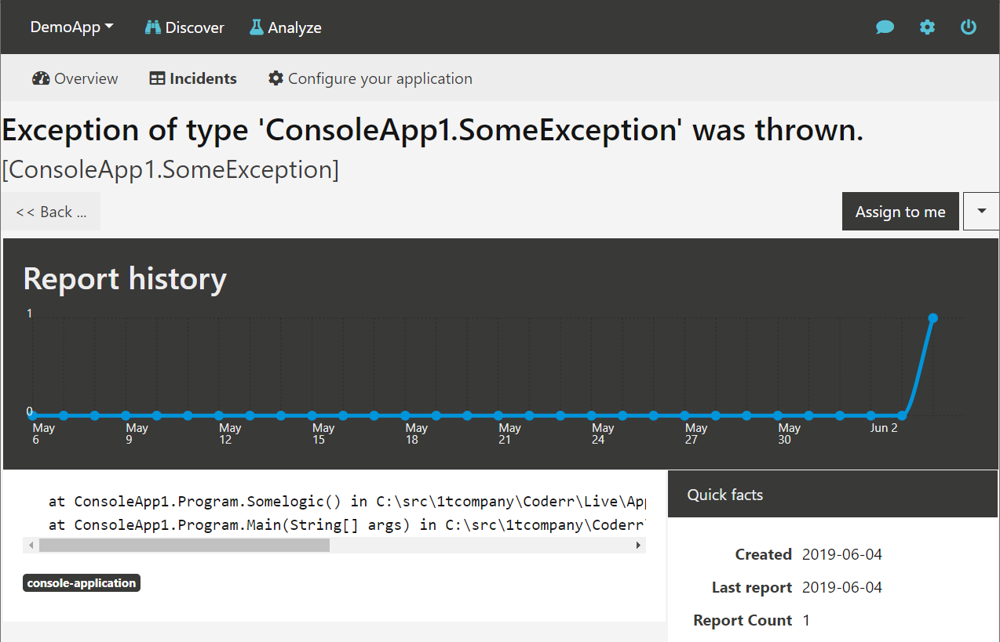
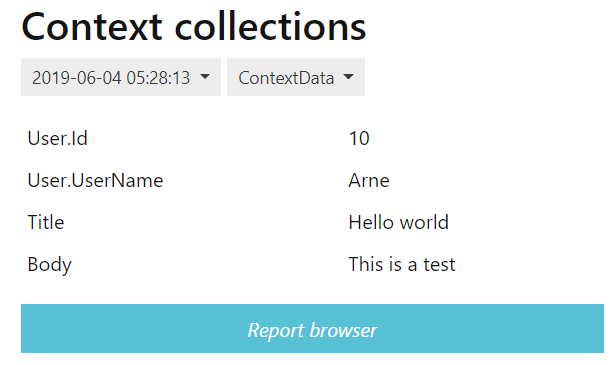
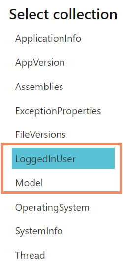

Manual reporting
================

The `Err` class in the client library is the main API for reporting errors with Coderr. 

In its simplest form reporting is done by using the `Err.Report(exception)` method.

```csharp
try
{
    somelogic();
}
catch(SomeException ex)
{
	Err.Report(ex);
}
```

The exception should appear in your server instance shortly after being reported. If you click on it it will be available as follows:



If you run the code multiple times you'll see that the "Report count" counter will increase, but you will not get multiple errors as you would have in a log file.

## Attaching context information

An exception, by itself, does not contain much information. Look at this example when trying to access a non-existent key in a `Dictionary<TKey, TValue>`:

`'The given key was not present in the dictionary.'`

The message tells you the type or error, but not which key was missing. In contrast, the automated reporting includes all information that you need.

However, when you have your own try/catch blocks, it might make more sense to attach relevant context information manually.

Here is how you do it manually by using a second parameter:

```csharp
try
{
    _repository.Create(forumPost);
}
catch (Exception ex)
{
    Err.Report(ex, forumPost);
}
```



The second parameter supports the `dynamic` keyword and complex structures. 

```csharp
try
{
    // some example
}
catch (Exception ex)
{
    Err.Report(ex, new
    {
        User = new { Id = 5, LastName = "Perik" },
        Discount = new { Id = 4848 }
    });
}
```

# Adding multiple collections

It's possible to structure the attached data by passing an array of `ContextCollectionDTO` to the second argument:

```csharp
try
{
    //some stuff that generates an exception
}
catch (Exception ex)
{
    var model =  new ContextCollectionDTO("Model");
    model.Properties.Add("UserId", "10");
    model.Properties.Add("PostId", "30");

    var user =  new ContextCollectionDTO("LoggedInUser");
    user.Properties.Add("UserId", "32");
    user.Properties.Add("UserName", "gustaf");

    Err.Report(ex, new[]{ model, user });
}
```



To make that less cumbersome, Coderr is providing an extension method, `ToContextCollection()`.


```csharp
try
{
    //some stuff that generates an exception
}
catch (Exception ex)
{
    var model = viewModel.ToContextCollection("ViewModel");
    var user = User.ToContextCollection("User");
    Err.Report(ex, new[]{ model, user });
}
```

# Using tags

Tags are used to make it easier to find a specific type of error reports. You can for instance have tags like "backend", "performance", "sql" and similar.

Tags are attached by using the second parameter.

```csharp
try
{
    // some example
}
catch (Exception ex)
{
    Err.Report(ex, new { ErrTags = "sql,performance", UserId = 10});
}
```

You can add `ErrTags" to any context collection and the server will automatically pick it up.

# Attaching data with every report

You can also create context collections which will be automatically included with every reported error.

[Read more](../client/extending/contextprovider/)
