Getting started
===============

This document gives a technical overview of Coderr, installation help and how you configure and use Coderr.

# Installing the server

Coderr requires both that you install one or more of our nuget packages and that you use one of our server versions.

* [Coderr Community Server](https://github.com/coderrio/coderr.server) - Open Source, AGPL license.
* [Coderr Live](https://lobby.coderr.io) - Our hosted service (free up to 500 error reports / month).
* [Coderr Premise](https://coderr.io/features/premise) - Locally installed server with a complete feature set (including enterprise features).

Coderr is a client/server solution which means that you either need to install a server somewhere or use our hosted solution.

Coderr Server is available as three different editions.

<table><tr><td valign="top" style="width:30%">

### Coderr Live

Hosted service. Free for up to five users and up to 500 error reports per month.

[Register an account](https://lobby.coderr.io)

</td><td valign="top" style="width:30%">

### Coderr Premise

Locally installed server with a complete feature set (including enterprise features).

[Download](https://coderr.io/features/premise)

</td><td valign="top" style="width:30%">

### Coderr Community Server

Open source server, AGPL license.

[Github page](https://github.com/coderrio/coderr.server)

</td></tr></table>

Choose one and make sure that you have either registered an account or installed it. You can also [compare the editions](https://coderr.io/features/compare/).

# Reporting first error

Install or use one of the servers above.

Once installed, you need to configure one of our nuget packeges.
The packages are [listed here](./client/libraries/). Choose one and install it using nuget.

To configure Coderr you need to get an `appKey` and a `sharedSecret` from the server. Use a web browser and visit your Coderr Server. A default application have been created in Coderr and let's use that one when reporting the first errors.

In the top menu, use the drop down list and select "DemoApp".

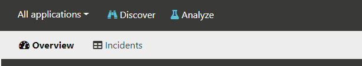

Now click on "Configure your application" in the sub menu:

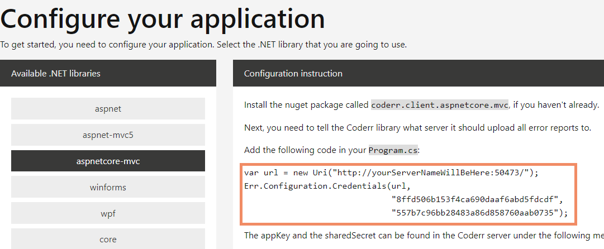

Select the .NET library that you are using.

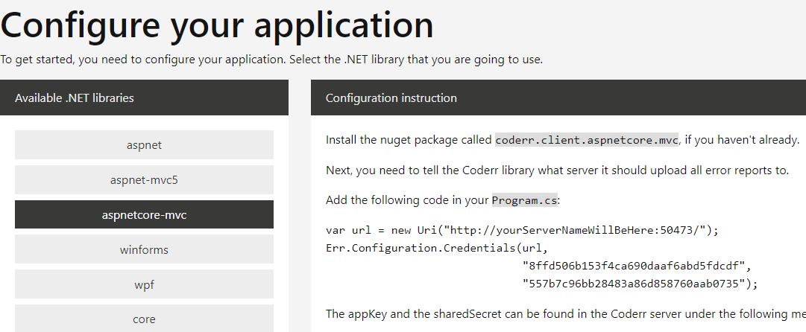


Copy the highlighted code into your application. Coderr is now ready to report errors.
Each automation library requires one or two additional lines for the automatic error detection. It's typically something in line with `Coderr.Configuration.CatchMvcExceptions()´. The readme file included in the nuget package contains more information.

To make sure that everything works, let's do a quick test. Paste this into the starting point (like Main in `Program.cs`).

```csharp
try
{
    throw new InvalidOperationException("Hello world");
}
catch (Exception ex)
{
    Err.Report(ex, new { ErrTags = "backend", User = new { Id = 10, FirstName = "Arne" }});
}
```

## Finding the first error

Visit the Coderr server web. The first page should now contain a reported error:

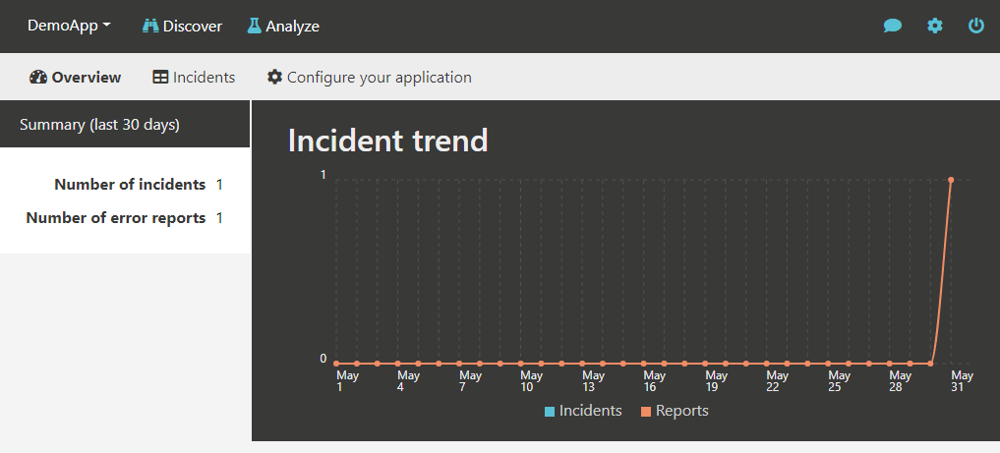

To see the error, click on the "Incidents" link to open the search page.

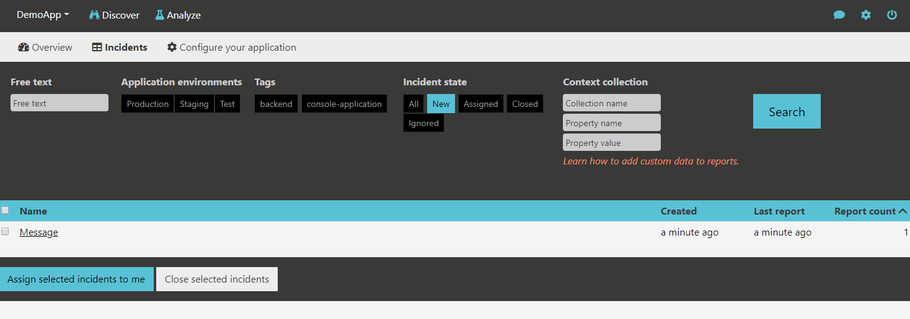

Since we included user information in the error report, we could also have searched for that user:

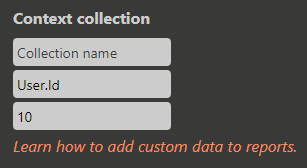

* Learn more about [context data](../features/incidents/context-data/)

Click on the incident in the search result.

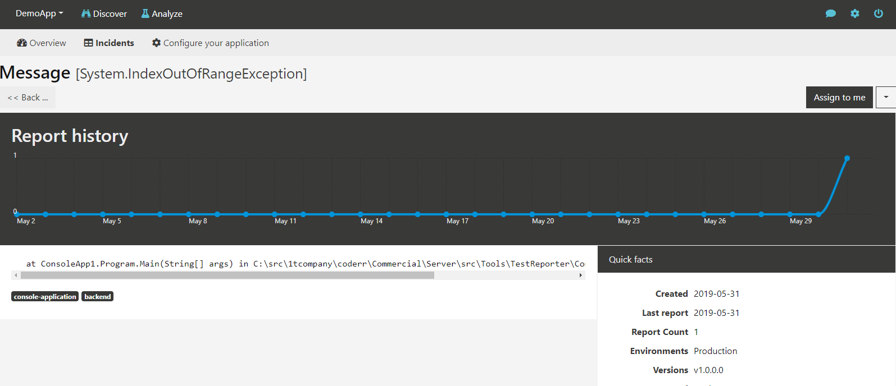

This view is only used to determine which errors to work with. Notice that Coderr include application version and which environment (in this case "Production") that the error was reported for. The tag, "backend", is also visible. Tags are typically used to group errors together. Coderr automatically include different tags like "ado.net", "entity-framework" etc. It all depends to where the exception was thrown.

* Learn more about [tags](../features/incidents/tagging/)
* Learn more about [environment tracking](../features/incidents/environments/)

All collected information will be available once you have clicked on the "Assign to me" button. Do it now.

## Solving the first error


The context data is available down right. The information that you included yourself is automatically displayed. But there are several other context collections avilable in the dropdown menu. You can for instance see used memory, Windows version, which assemblies (and their versions your application ran etc.

Once you have corrected the error, click the "Close incident" button.


By entering a version number, Coderr will automatically ignore all error reports for the same error if the reported version is less or equal with the specified version. That way, there is no need to check if the reported error have already been corrected.

* Learn more about [closing incidents](../features/incidents/close)


# Where to go next


A typical error handling flow consists of distinct steps that you need to take when working with errors.


1. You need to discover errors. Traditionally it's typically done by scanning log files or by receiving errors reports from users.
2. Once you receive an error report, you need to see if it's for an already known error or if for a new one.
3. When you have a list of errors, you want to work with the most important one. 
4. When you have selected an error, you need to be able to reproduce it so that you are sure that you are correcting the correct part of the code base.
5. Once you are sure about the cause, you can correct the error.

Coderr helps with all steps above except the last one. 

Coderr have been designed with that flow in mind to make it as easy as possible to identify, priortize and correct errors. There are three main sections.


* **Discover** - The starting point in Coderr. Used to find the incidents that should be corrected first. Once you found one, click "Assign to me" on it.
* **Analyze** - All incidents assigned to you will be found here, including all collected context data.
* **Deployment insights** - See how well your team has handled errors in each application release. Do the number of distinct errors increase or decrease?

All data can be filtered by using the application selection menu which can be seen to the far left. Click on it to see errors for one application only or for all applications.

## Finding errors to work with

Use the "Discover" menu to find errors to correct. This section shows the number of errors per application, how often they have occurred and other information about how they affect your system.


### Suggestions / Prioritization

In Coderr Premise and Coderr Live the "Suggestions" menu allows you to work with the errors that have the largest impact on your system. In this section, Coderr has prioritized errors based on different operational aspects. You can also add your own prioritization criteria based on your own business rules.

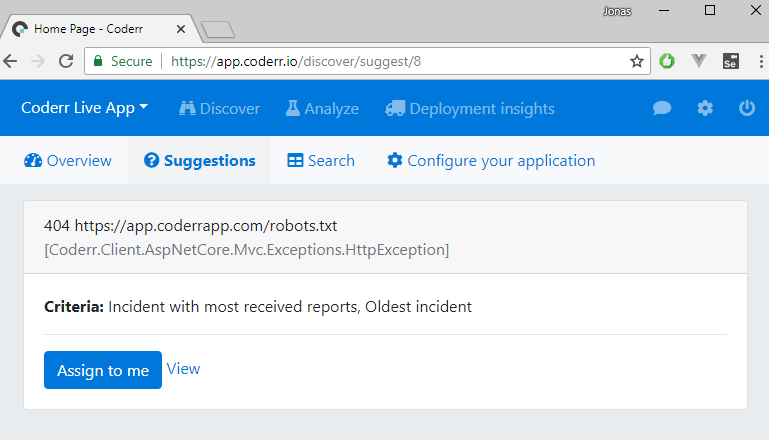

[How to configure prioritization](/features/partitions/)


### Search

The "search" menu option allows you to filter the error list using different options like tags, free text and incident state. Your last search is automatically used every time you visit the search page.

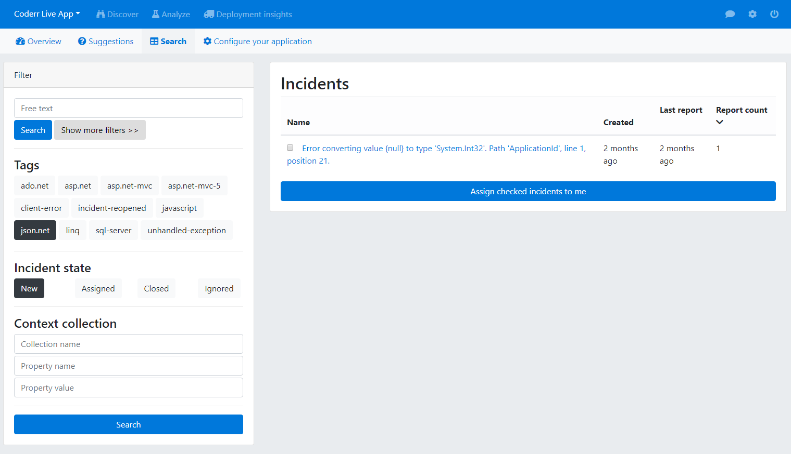

The "Context collection" search option is quite powerful. Enter a user id to see how many errors a specific user has got. Requires that you have attached context data to your errors. [Read more](../client/manual-reporting/)


# Analyzing errors

Once you have assigned an incident to yourself, you can start to use the "Analyze" section of Coderr. It's designed to be able to help you understand why the error occurred. You can find all contextual information here, and the result of all built in analysis features.

To get started, click on "Analyze" and then use the second drop down to switch between your incidents.

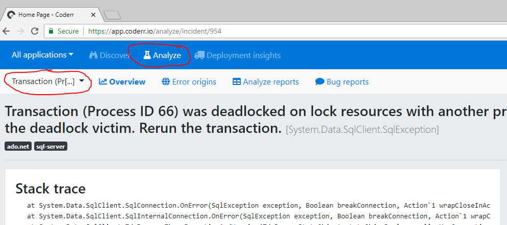

## Context information

Coderr includes context information out of the box.

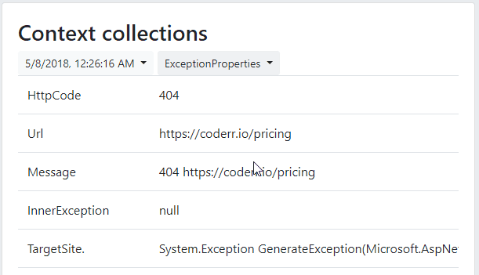

But sometimes you might want to include information which is relevant to your application. 

You can either attach context data each time you call `Err.Report(ex, contextData)` or get it automatically included with every report by creating a [context collection provider](/client/extending/contextprovider/).

## Closing incidents

Use the "Close"-action when an incident has been corrected.

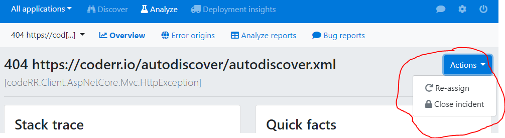

Closing incidents tell Coderr to ignore all future error reports for the same error that are for same or older version of the application.

That requires that you use proper versioning in your application (`[major].[minor].[step/build]`).

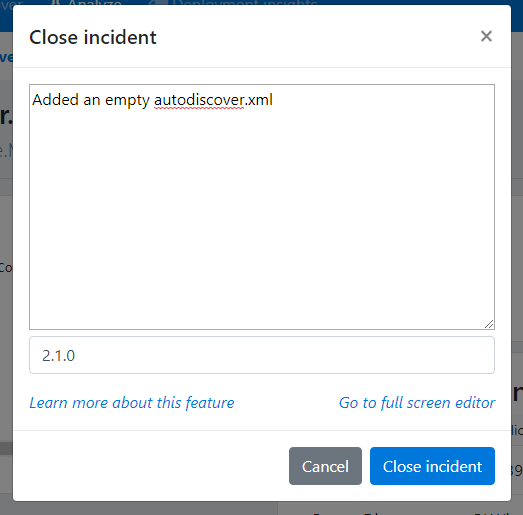

If the error resurfaces in newer versions, you will also be able to see how you solved it last time.

# Before going to production

Read this section carefully to configure Coderr correctly.

### Disabling Coderr's internal errors

When getting started with Coderr, it makes sense to allow Coderr to throw exceptions if the configuration is invalid or if reports can't be uploaded to the Coderr Server.

Once everything is OK, Coderr should not interfere with your application. Thus, you need to disable Coderr's own ability to throw exceptions.

```csharp
Err.Configuration.ThrowExceptions = false;
```

### Conditionally activate Coderr

The main purpose of Coderr is to identify errors in production environments. 

As a developer, you typically have full control of errors happening in developer environments. Thus it doesn't make sense to have Coderr  activated in development environments. 

To keep the error list clean, we recommend that you conditionally activate Coderr.
 
#### Conditionally activate Coderr in .NET 4.x

Add an app setting in your configuration file:

```xml
<appSettings>
   <add key="Environment" value="Production">
</appSettings>
```

Then check it when configuring Coderr (typically somewhere in `Program.cs`):

```csharp
if (ConfigurationManager.AppSettings["Environment"] == "Production")
{
    // This line is the one that activates the report uploads.
    Err.Configuration.Credentials("xxx");
}
```

#### Conditionally activate Coderr in .NET Core

Add an app setting in your configuration file (`appsettings.json`):

```json
{
  "Coderr": {
      "Activate": true
  },
  /*rest of the config */
  "ConnectionStrings": {
    "Db": "Data Source=.;Initial Catalog=Coderr14;Integrated Security=True;Connect Timeout=15;"
  },
}

```

Then check it when configuring Coderr (typically somewhere in `Startup.cs`):

```csharp
if (Configuration["Coderr:Activate"] == "true")
{
    // This line is the one that activates the report uploads.
    Err.Configuration.Credentials("xxx");
}
```

# Further readings

Don't hesitate to [email us](mailto:help@coderr.io) if you need help. Our [Guides and support](https://coderr.io/guides-and-support/) is otherwise a perfect place to visit next.