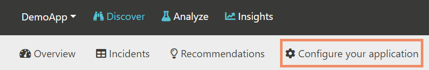

Getting started
===============

This guide is intended for first time users to get Coderr up and running with the most common features.

# Installing the server

The Coderr server are used to analyze error reports and to correct errors. Select the edition that fits your requirements.

<table style="padding: 20px"><tr><td valign="top" style="width:30%">

### Coderr Live

Hosted service. All features except enterprise features. 

Free up to five users and up to 500 error reports/month.

[Register an account](https://lobby.coderr.io)

</td><td valign="top" style="width:30%">

### Coderr Premise

Locally installed server with a complete feature set.

Free up to 500 error reports/month.

[Download](https://coderr.io/features/premise)

</td><td valign="top" style="width:30%">

### Coderr Community Server

Open source server.

AGPL license.

[GitHub page](https://github.com/coderrio/coderr.server)

</td></tr></table>

Choose one and make sure that you have either registered an account or installed it. You can also [compare the editions](https://coderr.io/features/compare/).

# Configuring your application

Install one of our nuget packages in your application.
The available packages are [listed here](./client/libraries/). 

An `appKey` and a `sharedSecret` is required to configure the the package. They are obtained from the server. Use a web browser and visit your Coderr Server. Lets use the default application, DemoApp, to report the first errors.

In the top menu, use the drop down list and select "DemoApp".


Next, click on "Configure your application" in the sub menu.



You will now see the configuration page which contains copy/paste instructions.


Select the .NET library that you are using in your application and then copy the marked code into your application. 

Coderr is now ready to report errors.

Each automation library requires one or two additional lines for the automatic error detection. It's typically something in line with `Coderr.Configuration.CatchMvcExceptions()`. The readme file included in the nuget package contains more information.

# Reporting the first error

To make sure that everything works, let's do a quick test. Paste the following code into the starting point (like Main in `Program.cs`).

```csharp
try
{
    throw new InvalidOperationException("Hello world");
}
catch (Exception ex)
{
    Err.Report(ex, new { ErrTags = "backend", User = new { Id = 10, FirstName = "Arne" }});
}
```

Congratulations. You have now reported an error. You could also try to run that code multiple times. It will still be reported as a single error in Coderr (a counter will be increased and you'll also be able to browse all reports for the same error).

# Finding the first error

It's time to see how the previously reported error looks like in Coderr.

Visit the Coderr Server web. The first page should now contain a reported error:


To see the error, click on "Incidents" in the submenu to open the search page.


Since we included user information in the error report, we could have searched for that specific user:


Attaching and searching context data is a powerful way of managing errors. You can learn more about [context data](../features/incidents/context-data/)

Click on the incident name in the search result to open the incident summary page.


This view is only used to decide which errors to work with. All details will be available once you have assigned errors to yourself.

Coderr automatically include which application version that the error was reported for, which environment (in this case "Production") and the tag, "backend", that we attached to the error report. 

[Tags](../features/incidents/tagging/) are typically used to group errors together. Coderr automatically include different tags like "ado.net", "entity-framework" etc. It all depends to where the exception was thrown.

You can configure [environment tracking](../features/incidents/environments/) by using the `Err.Configuration.EnvironmentName` property in the client library. It works out of the box for ASP.NET Core applications (and when you run your application through Visual Studio).

# Solving the first error

Once you have decided which error you want to work with, click on the "Assign to me" button top right.

You are now in the analyze view.


Look at the context data down right. It contains the user object which we attached when reporting the error. Coderr supports complex objects and you could have attached for instance a forum post and the user that tried to post it.

There are also several other context collections available in the dropdown menu. You can for instance see used memory, Windows version, loaded assemblies (and their versions) etc.

Once you have corrected the error, click the "Close incident" button.


By entering a version number, Coderr will automatically ignore all error reports for the same error if the reported version is less or equal with the specified version. That way, there is no need to check if reported errors already have been corrected.

Learn more about [closing incidents](../features/incidents/close)

# Before going to production

Read this section carefully to configure Coderr correctly.

## Disabling Coderr's internal errors

When getting started with Coderr, it makes sense to allow Coderr to throw exceptions if the configuration is invalid or if reports can't be uploaded to the Coderr Server.

Once everything is OK, Coderr should not interfere with your application. Thus, you need to disable Coderr's own ability to throw exceptions.

```csharp
Err.Configuration.ThrowExceptions = false;
```

# Where to go next

If you are using our commercial editions you might want to read about [recommendations](../features/discover/recommendations/) or [Insights](../features/insights).

Don't hesitate to [email us](mailto:help@coderr.io) if you need help. Our [Guides and support](https://coderr.io/guides-and-support/) is otherwise a perfect place to visit next.