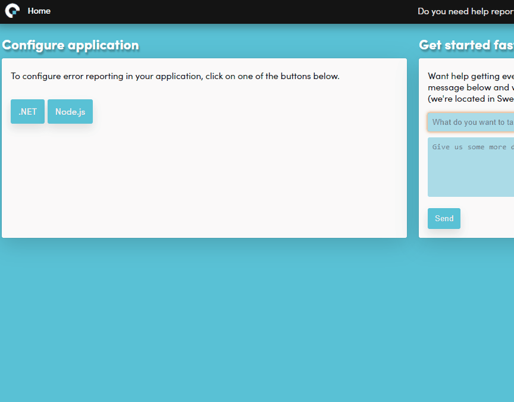

Getting started
===============

This guide is intended for first-time users to get Coderr up and running with the most common features.

# Coderr Server

The Coderr server receives the error reports from the client libraries and analyzes and sorts them into distinct errors.

Select the [edition](https://coderr.io/try) that fits your requirements.


# Configuring your application

_(All code examples in this guide are in C#, but the API is the same for all languages.)_

Install one of our client libraries in your application.
The available packages are [listed here](../client/). 

The `appKey` and the `sharedSecret` are required to configure the library, get them from the server UI. Use a web browser and visit your Coderr Server. Let's use the default application, DemoApp, to report the first errors.

**_Click on the `Do you need help reporting errors?` link and then scroll down to "Reporting the first error" in this guide. The following section shows where you can find the settings later on._**

## Global dashboard

The first page that you see is the dashboard. It contains a summary of all your applications and the errors you have assigned to yourself.

Use the drop-down list in the top menu and select "DemoApp". It takes you to the home page for that application; In it, you'll see all errors and the effect they have on your application.


## Application dashboard

This is the application summary page where all application-specific errors are located.

Click on "Configure your application" in the sub-menu.


## Application administration

Use the application administration page to configure different aspects of error reporting for a specific application. You can, for instance, let Coderr prioritize the errors for you.

Click on the Configure button to see the lines required to activate the client libraries.



Select the language you are using and then the correct library (you can use multiple libraries, for instance, one to collect logs and one for automated detection).

Each integration library requires one or two additional lines to get automated error detection. It's typically something in line with `Coderr.Configuration.CatchMvcExceptions()`. The readme file included in the nuget package contains details.

# Reporting the first error

To make sure that everything works, let's do a quick test. First, paste the following code into the starting point (like Main in `Program.cs`).

```csharp
try
{
    throw new InvalidOperationException("Hello world");
}
catch (Exception ex)
{
    Err.Report(ex, new { ErrTags = "backend", User = new { Id = 10, FirstName = "Arne" }});
}
```

The error should be visible in the Coderr server directly.

Use the second `Err.Report` parameter to attach context information to error reports. The result from this example is shown further down in the article.

If you have turned on browser notifications, the following notification is shown in your OS:


If not, visit your Coderr server. 

* [Turn on browser notifications](../features/incidents/notifications/)

# Finding the first error

It's time to see how the reported error looks like in Coderr.

Visit the Coderr Server web. The first page should now contain a reported error:


Coderr (commercial editions) recommends the most severe errors on this page. You can [customize](https://coderr.io/documentation/features/recommendations/) how Coderr should prioritize errors.

Click on the error to discover all telemetry, where the error is reported from, logs, and other information you need to solve the error quickly. If you are interested in the most recent log lines before the error occurred, install one of our logging integration libraries.

## Search

Use the search feature to find errors relevant to your expert areas.


You can, for instance, find all errors that a specific user had.

The following search options are available:

* _**Free text**_ searches through the entire error reports after the given information.
* _**[Application environments](../features/incidents/environments)**_ allows you to find errors that exist in a specific environment (like production).
* _**[Tags](../features/incidents/tags)**_ are used to categorize errors to allow developers to correct a specific type of error (depending on your expertize).
* _**Incident state**_ can be used to search through other than new incidents.
* _**[Context collections](../features/incidents/context-collections)**_ are telemetry data, either collected automatically by Coderr, or supplied by you.

You can also save your searches into the tabs to the right. Maybe one search for UX-related errors and one for all database-related errors.

### Finding a specific user

You can attach application-specific information to an error, like user id or server tracking. When manually reporting errors, you do it like:

```csharp
Err.Report(ex, new { ErrTags = "backend", User = new { Id = 10, FirstName = "Arne" }});
```

.. once done, we can search for that specific user:


Attaching and searching context data is a powerful way of managing errors. 

[Learn more context collections](../features/incidents/context-collections/)

# Correcting an error

Once you have found an error to work with, click on it to see more details.


The graph shows how frequently Coderr has received error reports for this incident.

## Product impact

Product impact list different aspects regarding how this error affect your application and users.

For instance: 

* When the error was detected by Coderr.
* When the most recent report was received.
* That the error only exists in production.
* That we have only received reports for v1.0.1 of the application.

[Learn more about product impact](../features/incidents/quickfacts/)

## Features used when reporting

The following features were used when reporting the error.

* [Tags](../features/incidents/tags/) 
* [Environment tracking](../features/incidents/environments/)
* [Custom context data](../features/incidents/context-collections#Custom)

# Solving the first error

Select yourself in the "Assigned to" drop-down when you want to start working with an error.

Apart from the information in this view, each error also contains the following information:

* Geographic origins of error reports
* Error report browser
* Bug reports from users
* Latest log entries (from your favorite logging library)
* [Business impact](/features/recommendations/)

Everything from bug reports written by users to telemetry and logs are always found under each distinct error.

## Close incident

Select "Closed" in the state drop-down once you have corrected the error.


By entering a version number, Coderr ignores all future error reports for older application versions. That way, there is no need to check if reported errors have been corrected.

Learn more about [closing incidents](../features/incidents/close)

# Before going to production

Read this section carefully to configure Coderr correctly.

## Disabling Coderr's internal errors

When getting started with Coderr, it makes sense to allow Coderr to throw exceptions if the configuration is invalid or if reports can't be uploaded to the Coderr Server.

Once everything is OK, Coderr should not interfere with your application. Thus, you need to disable Coderr's own ability to throw exceptions.

```csharp
Err.Configuration.ThrowExceptions = false;
```

You might also want to upload reports in the background:

```csharp
Err.Configuration.QueueReports = false;
```


# Where to go next

If you are using our commercial editions, you might want to read about [recommendations](../features/recommendations/).

Don't hesitate to [email us](mailto:help@coderr.io) if you need help. Our [Guides and support](https://coderr.io/guides-and-support/) is otherwise a perfect place to visit next.