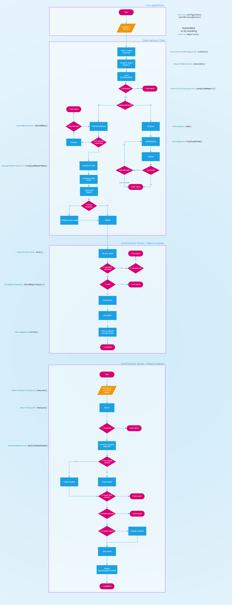

Coderr documentation
===============

Welcome to the Coderr documentation. 

The documentation have been divided into two sections:

# Client documentation

The client libraries are used in your own application to be able to detect and report exceptions.

The documentation focuses on usage, but also have a small section that shows how you can extend the client libraries and/or build your own for your favorite framework.

[Client documentation](client/index.md)

# Server documentation

The server documentation show how you can install and configure Coderr Community Edition, which is the open source alternative to our hosted solution Coderr Live.

There is also a section that shows you can write your own plugins for the Community Edition and the OnPremise commercial alternative.

[Server documentation](server/index.md)

# Coderr pipeline

Below is an illustration of the Coderr pipeline.

It shows how an exception is handled from the first detection to being analyzed in the server.

***Integration tip:** Analysis services should subscribe on the `ReportAddedToIncident` event. By doing so, your analyzer class will automatically invoked in the end of the pipeline.*

