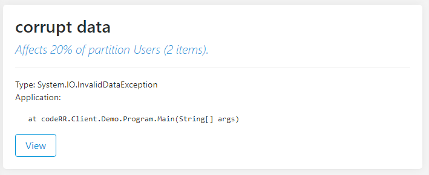

Reporting errors
================

This guide intends to give you a brief overview for all our features with links to in depth articles for each feature.
Most of our client libraries support automated reporting, read their respective [documentation](client/index.md) for more information about and which context providers each client has.. 


# Prerequisites

This guide assumes that you have installed and configured one of our [client libraries](client/index.md).

You have also created an account at [codeRR Live](https://app.coderrapp.com) or in your locally installed [codeRR Community Server](server/installation.md).

# Before going to production

Disable the client library's ability to throw exceptions when something is wrong. 

```csharp
Err.Configuration.ThrowExceptions = false;
```

Allowing the client library to throw exceptions is only valuable when you are configuring/learning how to use the Coderr client library.

# Reporting errors manually

The `Err` class in the client library is the main API for codeRR. 

In its simplest form you report errors by using the `Err.Report(exception)` method.

```csharp
try
{
    somelogic();
}
catch(SomeException ex)
{
	Err.Report(ex);
}
```

The exception should appear in your server instance shortly after being reported.


## Attaching context information

An exception, by itself, do not convey a story. A typical example is when you try to access a non-existent key in a `Dictionary<TKey, TValue>`:

> 'The given key was not present in the dictionary.'

When you have your own try/catch blocks, it makes sense to attach relevant context information.

You can do that by using a second parameter:

```csharp
try
{
    //some stuff that generates an exception
}
catch (Exception ex)
{
    Err.Report(ex, yourContextData);
}
```


That option is quite flexible. It support complex structures and the `dynamic` keyword. Read more in our [manual reporting guide](client/manual-reporting.md).

# Using tags

Tags both allow you to categorize incidents and to limit searches at stackoverflow.com


To get started, add a property named `ErrTags` to any context collection (or by using the second `Report` parameter):

```csharp
// Adds two tags
Err.Report(ex, new { ErrTags = "important,backend" });
```

[Read more about tags](client/tags)


## Controlling report uploads

By default, reports are thrown away if the upload fails, to not interfere with your application. 

To enable the internal memory queue, use the following command to activate it:

```csharp
Err.Configuration.QueueReports = true;
```

The queue also makes sure that there is no delay our UI-unresponsiveness as the upload is made on a background thread.

To learn how to further control the error report uploads, read our [customizing uploads guide](client/customize-uploads.md).

## Adding your own automated context providers

Context providers are used to automatically attach information to each error report. The information is useful to determine why an exception have been thrown.


In your own application you probably have system specific information that you always want to include when errors are reported. For example `tenantId`,  `customerId` or the logged in user.

[Learn how to create your own context information provider](client/context-provider.md)


## Getting smarter prioritization

***Feature only available in Coderr Live and Coderr OnPremise***

Coderr can recommend which error you should correct next based on different operational aspects.



To activate the feature you need to add partitions which allows Coderr to calculate the effect that each incident have on your system.

[Read more about partitions](client/partitions.md).

# More information

Each nuget library has its own unique features. You can find the documentation for each one in the [client start page](client/index.md).
