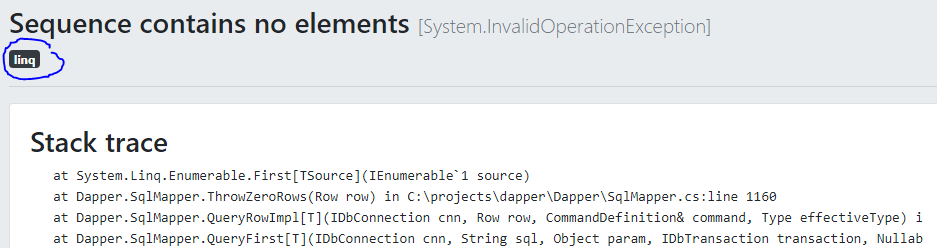

Reporting errors
================

This guide intends to give you a brief overview of all of Coderr reporting features with links to in-depth articles for each of them.

Most of our client libraries support automated reporting. Find out what context collections is included for each client and more in the [documentation](client/index.md).


# Prerequisites

To fully take advantage of this guide, we recommend you to have installed and configured one of our [client libraries](client/index.md).

You should also have created an account at [Coderr Live](https://app.coderr.io) or in your locally installed [Coderr Community Server](server/installation/).

# Settings

There are some important settings to be aware of from the start. 

Before going to production, disable the client library's ability to throw exceptions when something is wrong. 

```csharp
Err.Configuration.ThrowExceptions = false;
```

Allowing the client library to throw exceptions is only valuable when you are configuring/learning how to use the Coderr client library.

# Reporting errors manually

The `Err` class in the client library is the main API for Coderr. 

In its simplest form you report errors by using the `Err.Report(exception)` method.

```csharp
try
{
    somelogic();
}
catch(SomeException ex)
{
	Err.Report(ex);
}
```

The exception should appear in your server instance shortly after being reported.


## Attaching context information

An exception, by itself, does not contain much information. Look at this example when trying to access a non-existent key in a `Dictionary<TKey, TValue>`:

`'The given key was not present in the dictionary.'`

The message tells you the type or error, but not what key was missing. In contrast, the automated reporting includes all information that you need.

However, when you have your own try/catch blocks, it might make more sense to attach relevant context information manually.

Here is how you do it manually by using a second parameter:

```csharp
try
{
    //some stuff that generates an exception
}
catch (Exception ex)
{
    Err.Report(ex, yourContextData);
}
```


Note that this option is quite flexible as it supports complex structures and the `dynamic` keyword. Read more in our [manual reporting guide](client/manual-reporting.md).

# Using tags

Tags both allow you to categorize incidents and to limit search results when browsing stackoverflow.com for solutions.



To get started with tags, add a property named `ErrTags` to any context collection (or by using the second `Report` parameter):

```csharp
// Adds two tags
Err.Report(ex, new { ErrTags = "important,backend" });
```

[Read more about tags](client/tags)


## Controlling report uploads

Reports that fail to upload are thrown away by default, to avoid interfering with your application. 

To enable queued report uploads, use the following configuration line to activate it:

```csharp
Err.Configuration.QueueReports = true;
```

When reports are being uploaded, the queue makes sure that your UI-unresponsiveness is unaffected.

There is more information about how to control the error report uploads in our [customizing uploads guide](client/customize-uploads.md).

## Adding your own automated context providers

Context providers commonly attach information automatically to each error report. This information is useful to have when determining why an exception was thrown.


In your own application you probably have system specific information that you always want to include when errors are reported. For example `tenantId`,  `customerId` or the logged-in user.

[Learn how to specify your own context information](client/context-provider.md)


## Enhanced prioritization

***Feature only available in Coderr Live and Coderr OnPremise***

Coderr can recommend which error for you to focus on and to correct, based on criteria set by you. These setting will align with your operational and business priorities and impact. Here is an example:


Here, Coderr is suggesting two incidents based on their operational affect on your database servers and based on the number of affected users.

Enhanced prioritization requires you to add partitions, allowing Coderr to calculate the effect on your system for each incident.

[Read more about partitions](features/partitions/).

# More information

Each nuget library has its own unique features described in the documentation. You can find each of them here in the [client start page](client/index.md).
