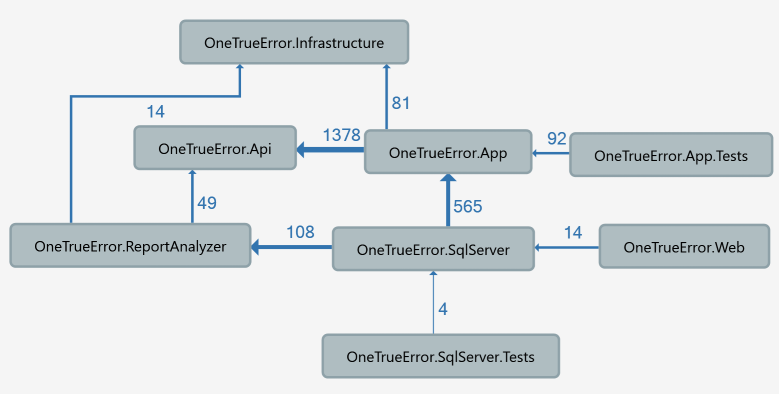
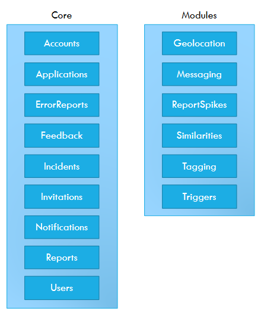
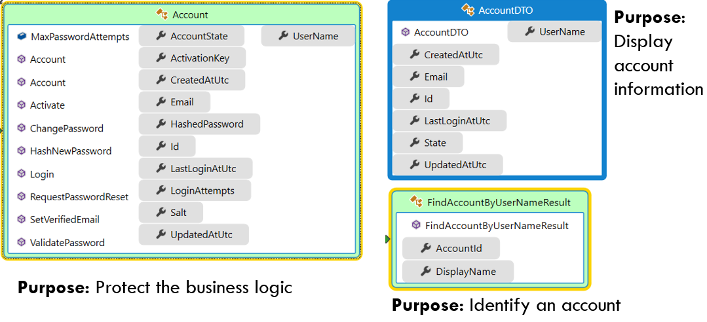
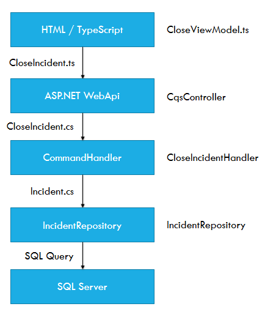

# Architecture

This is CodeProject after all, thus you might be interested in how the service is designed. This section will go through different aspects of the design, from used patterns to selected libraries and, of course, code.

## Structure

Coderr is a monolith, i.e. everything is run as a single application. 

Let's take a look at the solution structure with the help of a dependency diagram:



Coderr consists of the following components:

 Name | Description 
----|------
Infrastructure | Contains classes for configuration, messaging, serialization etc.
Api | Defines the contracts used when different modules want to communicate, we'll get back to that later.
App | The business layer, notice that it do not depend on anything else but the API.
App.Test | Those (few) unit tests that exists to date.
ReportAnalyzer | Do the initial analysis to identify and process incidents and reports.
SqlServer | A Microsoft SQL Server implementation of the data layer.
SqlServer.Tests | Integration tests
Web | ASP.NET WebApi + MVC. The front end

## Modules

Within the App and Api components, Coderr is divided into different modules (or rather separation of concerns).



The implementation of those modules are placed in the App component while the Api defines how each module can be used. 

The only means of allowed communication between the modules is through messaging and the classes defined in Api component. For instance the incident module may not use the `IAccountRepository` defined in the account module, but should instead invoke the `GetAccount` query defined in the Api component. This design decision was made to make sure that all modules are loosely coupled and therefore much easier to maintain. As long as you make sure that the defined API messages are handled OK you are free to refactor or change the internals in the modules without having to worry about breaking changes.

### Module architecture

Each module is separated into traditional layers.

* Service layer
* Business layer
* Data layer

The service layer is implemented with as CQRS handlers with the help of Griffin.Framework, more about that in the next article section. The business layer contains of domain entities where focus has been on encapsulation. All state changes are made through methods and all properties are declared as private. The data layer is represented by repositories, which handles business entities, and query objects for the read side.

## CQRS

Messaging within OTE is done through commands, queries and events. Martin Fowler has an [article](http://martinfowler.com/bliki/CQRS.html) which explains the pattern. In Coderr we are using the declared interfaces in [DotNetCqs](https://github.com/jgauffin/dotnetcqs) to separate the definition from the implementation. 

CQRS was selected as it separates read from write. It's an important aspect as it removes coupling between different concerns for the same entity and thus reduces the amount of changes or compromises that else is forced upon each entity. 

Here we got three different representations of the same account:



They have different responsibilities, both to the right contains just a subset of the information in the business entity. If we would like to display more information in the UI, we only have to change the DTO for the query. Nothing else is touched within the service and the likelihood of screwing up the write model (i.e. business logic) is zero.

The most common alternative to CQRS/CQS is to use so called handler/manager/service classes. They are typically responsible of all operations for a specific entity type. They do therefore tend to get fat and complex which makes them harder to maintain.

Let's see how we live up to the CQRS pattern.
 
### The command

Commands should be seen as a business transaction, i.e. the execution of it might involve one ore more business entities.

In Coderr the command/query is separated from the execution. The command/query is more of an instruction, a [Data Transfer Object](http://martinfowler.com/eaaCatalog/dataTransferObject.html), which will be executed by a command/query handler in the backend.

A command can look like this:

```csharp
public class InviteUser : Command
{
	public InviteUser(int applicationId, string emailAddress)
	{
		if (applicationId <= 0) throw new ArgumentOutOfRangeException("applicationId");
		if (emailAddress == null) throw new ArgumentNullException("emailAddress");
		
		ApplicationId = applicationId;
		EmailAddress = emailAddress;
	}

	protected InviteUser()
	{
	}

	public int ApplicationId { get; set; }

	public string EmailAddress { get; private set; }

	public string Text { get; set; }

	[IgnoreField]
	public int UserId { get; set; }
}
```

The command DTO must be designed to maximize the possibility for it to be executed successfully. This is done by putting all required fields in the constructor an validating them. Optional fields are set by using properties.

The command above is executed by using the `ICommandBus` like this:

```csharp
var cmd = new InviteUser(3, "some@email.com");
await _cmdBus.ExecuteAsync(cmd)
```

### The command handler

Once the command have been received by the server it must be exeucted. That is done by a class which implements the `ICommandHandler<TCommand>` interface:

In this case it's the [InviteUserHandler](https://github.com/gauffininteractive/Coderr.Server/blob/master/src/Server/Coderr.App/Core/Invitations/CommandHandlers/InviteUserHandler.cs). It's shortened below to just show the contents of a handler.

```csharp
[Component]
internal class InviteUserHandler : ICommandHandler<InviteUser>
{
	private readonly IApplicationRepository _applicationRepository;
	private readonly ICommandBus _commandBus;
	

	public InviteUserHandler(IInvitationRepository invitationRepository, ICommandBus commandBus)
	{
		_invitationRepository = invitationRepository;
		_commandBus = commandBus;
	}

	public async Task ExecuteAsync(InviteUser command)
	{
		var inviter = await _userRepository.GetUserAsync(command.UserId);
		var invitedUser = await _userRepository.FindByEmailAsync(command.EmailAddress);
		if (invitedUser != null)
		{
			var member = new ApplicationTeamMember(command.ApplicationId, command.EmailAddress)
			{
				AccountId = invitedUser.AccountId,
				AddedByName = inviter.UserName,
				Roles = new[] {ApplicationRole.Member}
			};

			await _applicationRepository.CreateAsync(member);
			return;
		}
		
		//more code here

		var evt = new UserInvitedToApplication(command.ApplicationId,
			command.EmailAddress,
			inviter.UserName);

		await _eventBus.PublishAsync(evt);
	}

}
```

Another design decision have been made regarding commands in Coderr. The command is just a promise of an action which will happen in the near future. That distinction is really important as you need to design your applications differently. In a regular WCF service or web application you know that as soon as the service or controller have returned the action have been executed and the result is therefore available. 

Since the command is executed after the invocation to the bus returns, you cannot make that assumption. Therefore you need another mechanism to act upon executed commands.

### The event

As mentioned above, all commands are just a promise of a near future execution. To be able to act upon those executions we use events.

Events also allows us to define a public API which is not coupled to the actual implementation of commands. We just know that somewhere in some point in time something successfully executed a command.

Therefore events are a way to notify that the application state have changed in some way, most commonly due to a command have been executed.


```csharp
public class UserInvitedToApplication : ApplicationEvent
{
	public UserInvitedToApplication(int applicationId, string emailAddress, string invitedBy)
	{
		if (emailAddress == null) throw new ArgumentNullException("emailAddress");
		if (invitedBy == null) throw new ArgumentNullException("invitedBy");
		if (applicationId <= 0) throw new ArgumentOutOfRangeException("applicationId");

		ApplicationId = applicationId;
		EmailAddress = emailAddress;
		InvitedBy = invitedBy;
	}

	protected UserInvitedToApplication()
	{

	}

	public int ApplicationId { get; private set; }
	public string EmailAddress { get; private set; }
	public string InvitedBy { get; private set; }
}
```

The event itself is executed by the `IEventBus`:

```csharp
var evt = new UserInvitedToApplication(command.ApplicationId,
	command.EmailAddress,
	inviter.UserName);

await _eventBus.PublishAsync(evt);
```

### The event handler

Here is a sample handler:

```csharp
[Component(RegisterAsSelf = true)]
internal class CreateDefaultAppOnAccountActivated : IApplicationEventSubscriber<AccountActivated>
{
	private readonly ICommandBus _commandBus;

	public CreateDefaultAppOnAccountActivated(ICommandBus commandBus)
	{
		_commandBus = commandBus;
	}

	public async Task HandleAsync(AccountActivated e)
	{
		var cmd = new CreateApplication("SampleApp", TypeOfApplication.DesktopApplication)
			{
				UserId = e.AccountId
			};
		await _commandBus.ExecuteAsync(cmd);
	}
}
```

### Queries

Queries are a bit different since they should return a result.

For the actual implementation we are using [Griffin.Framework](https://github.com/jgauffin/griffin.framework) to execute all CQS objects.


## Pipeline

Before going into details let's see how a command travels through the service. 

In this case we are going to follow the close command which marks an incident as corrected (and sends an optional status update to all users that follows the incident).

The scenario starts when the user is viewing the close page and follows the command execution from the web to the database persistence.

The following picture will show all steps and transformations that it goes through before being executed and persisted in the database. Command representations are shown to the left and the classes that handles the command is shown to the right.



### View model

The view model is located in the ASP.NET project. It's a typescript class which looks like this:

```csharp
export class CloseViewModel implements Griffin.Yo.Spa.ViewModels.IViewModel {
	private app: ApplicationInfoResult;
	private context: ActivationContext;

	getTitle(): string {
		return "Close incident";
	}

	activate(context: Griffin.Yo.Spa.ViewModels.IActivationContext): void {
		this.context = context;
		this.incidentId = parseInt(context.routeData["incidentId"]);
		
		//get incident information through a query
		var query = new GetIncident(parseInt(context.routeData["incidentId"], 10));
		var incidentPromise = CqsClient.query<IncidentResult>(query);
		incidentPromise.done(result => context.render(result));

		//get the application from the SPA cache
		var service = new ApplicationService();
		var appPromise = service.get(context.routeData["applicationId"]);
		appPromise.done(result => {
			this.app = result;
		});

		//continue when both promises have completed
		P.when(incidentPromise, appPromise)
			.then(result => {
				context.resolve();
			});

		//hook into the view.
		context.handle.click("#saveSolution", evt => this.onCloseIncident());
		context.handle.click('[name="sendCustomerMessage"]', evt => this.onToggleMessagePane());
	}

	deactivate() {}

	onToggleMessagePane() {
		var panel = this.context.select.one("#status-panel");
		if (panel.style.display === "none") {
			panel.style.display = "";
		} else {
			panel.style.display = "none";
		}

	}

	onCloseIncident() {
		var solution = <HTMLInputElement>this.context.select.one('[name="solution"]');

		//execute the command
		var closeCmd = new CloseIncident(solution.value, this.incidentId);
		CqsClient.command(closeCmd);
		window.location.hash = `#/application/${this.context.routeData["applicationId"]}`;
		humane.log("Incident have been closed.");
	}

	incidentId: number;
}
```

### Typescript DTO

The `CloseCommand` DTO which is executed from the view model looks like this:

```csharp
export class CloseIncident {
	public static TYPE_NAME: string = 'CloseIncident';
	public CanSendNotification: boolean;
	public IncidentId: number;
	public NotificationText: string;
	public NotificationTitle: string;
	public ShareSolution: boolean;
	public Solution: string;
	public UserId: number;
	public CommandId: string;
	
	public constructor(solution: string, incidentId: number) {
		this.Solution = solution;
		this.IncidentId = incidentId;
	}
}
```

The interesting part is that the command is ***generated***. It's generated from the C# class with the help of the *TsGenerator* which resides in the src\Tools folder.

Notice the `TYPE_NAME` property which specifies the class name in C#. That field is included when the object is transfered over AJAX to the `CqsController`. More about that later.

### C# DTO

The C# DTO looks similar to the TypeScript class (obviously).

```csharp
public class CloseIncident : Command
{
	public CloseIncident(string solution, int incidentId)
	{
		if (solution == null) throw new ArgumentNullException("solution");
		if (incidentId <= 0) throw new ArgumentOutOfRangeException("incidentId");
		IncidentId = incidentId;
		Solution = solution;
	}

	public int IncidentId { get; private set; }
	public string Solution { get; private set; }

	public bool CanSendNotification { get; set; }
	public int UserId { get; set; }
	public string NotificationText { get; set; }
	public string NotificationTitle { get; set; }
	public bool ShareSolution { get; set; }
}
```

### CqsController

The ViewModel invokes the `CqsClient` which uses AJAX to send the DTO to the `CqsController`.
The `CqsContoller` have an internal registry (`CqsObjectMapper`) which have been built using reflection to find all Command/Queries in the API assembly and map their class names to the .NET type.
Thanks to that it's possible to identify the .NET type and therefore deserialize the inbound JSON to a .NET object.

The code for the controller is a bit too much to show here, but it basically uses the registry to find the correct .NET type, deserialize the inbound JSON and invoke the `CqsMessageProcessor` class which which in turn uses the inversion of control container to invoke the correct command handler. Got it? :)

The source code of the mentioned classes:

* [CqsClient (TypeScript)](https://github.com/gauffininteractive/Coderr.Server/blob/master/src/Server/Coderr.Web/Scripts/CqsClient.ts)
* [CqsController](https://github.com/gauffininteractive/Coderr.Server/blob/master/src/Server/Coderr.Web/Controllers/CqsController.cs)
* [CqsObjectMapper](https://github.com/gauffininteractive/Coderr.Server/blob/master/src/Server/Coderr.Web/Infrastructure/Cqs/CqsObjectMapper.cs)
* [CqsMessageProcessor](https://github.com/jgauffin/Griffin.Framework/blob/master/src/Griffin.Framework/Griffin.Cqs/CqsMessageProcessor.cs)

Still hanging in there? Feel free to scroll up to the pipeline image again for a quick recap before we continue. 

### CloseIncidentHandler

The framework have now located the correct command handler and is about to invoke it. 

```csharp
public class CloseIncidentHandler : ICommandHandler<CloseIncident>
{
	private readonly ICommandBus _commandBus;
	private readonly IFeedbackRepository _feedbackRepository;
	private readonly IIncidentRepository _repository;

	public CloseIncidentHandler(IIncidentRepository repository, IFeedbackRepository feedbackRepository,
		ICommandBus commandBus)
	{
		_repository = repository;
		_feedbackRepository = feedbackRepository;
		_commandBus = commandBus;
	}

	public async Task ExecuteAsync(CloseIncident command)
	{
		if (command == null) throw new ArgumentNullException("command");

		var incident = await _repository.GetAsync(command.IncidentId);
		incident.Solve(command.UserId, command.Solution);
		if (command.ShareSolution)
			incident.ShareSolution();

		if (command.CanSendNotification && !string.IsNullOrEmpty(command.NotificationTitle) &&
			!string.IsNullOrEmpty(command.NotificationText))
		{
			var emails = await _feedbackRepository.GetEmailAddressesAsync(command.IncidentId);
			var emailMessage = new EmailMessage(emails)
			{
				Subject = command.NotificationTitle,
				TextBody = command.NotificationText
			};
			var sendMessage = new SendEmail(emailMessage);
			await _commandBus.ExecuteAsync(sendMessage);
		}

		await _repository.UpdateAsync(incident);
	}
}
```

The handler does it's thing and that's it.

Notice that we do not directly modify the state of the incident, instead we invoke methods on the `Incident` entity to let it transition into another state. In that way we make sure that the incident itself is responsible of it's state. Less likely that we spread domain logic all over the code base and it's a lot easier to test and follow the logic in the code.

### IncidentRepository

As I've mentioned repositories are mostly used when working with domain entities. The repositories are hand coded and sometimes ADO.NET is used directly while in other cases the data mapper in Griffin.Framework is used.

```csharp
public class IncidentRepository : IIncidentRepository
{
	private readonly IAdoNetUnitOfWork _uow;

	public IncidentRepository(IAdoNetUnitOfWork uow)
	{
		if (uow == null) throw new ArgumentNullException("uow");
		_uow = uow;
	}

	public IEnumerable<IncidentSummaryDTO> FindLatestForOrganization(int count)
	{
		using (var cmd = _uow.CreateCommand())
		{
			cmd.CommandText =
				"SELECT TOP " + count + " * FROM Incidents WHERE IsSolved=0 ORDER BY UpdatedAtUtc DESC";
			return cmd.ToList<IncidentSummaryDTO>();
		}
	}

	public async Task UpdateAsync(Incident incident)
	{
		using (var cmd = (DbCommand)_uow.CreateCommand())
		{
			cmd.CommandText =
				@"UPDATE Incidents SET 
					ApplicationId = @ApplicationId,
					UpdatedAtUtc = @UpdatedAtUtc,
					Description = @Description,
					Solution = @Solution,
					IsSolved = @IsSolved,
					IsSolutionShared = @IsSolutionShared,
					IgnoreReports = @IgnoreReports,
					IgnoringReportsSinceUtc = @IgnoringReportsSinceUtc,
					IgnoringRequestedBy = @IgnoringRequestedBy
					WHERE Id = @id";
			cmd.AddParameter("Id", incident.Id);
			cmd.AddParameter("ApplicationId", incident.ApplicationId);
			cmd.AddParameter("UpdatedAtUtc", incident.UpdatedAtUtc);
			cmd.AddParameter("Description", incident.Description);
			cmd.AddParameter("IgnoreReports", incident.IgnoreReports);
			cmd.AddParameter("IgnoringReportsSinceUtc", incident.IgnoringReportsSinceUtc.ToDbNullable());
			cmd.AddParameter("IgnoringRequestedBy", incident.IgnoringRequestedBy);
			cmd.AddParameter("Solution",
				incident.Solution == null ? null : EntitySerializer.Serialize(incident.Solution));
			cmd.AddParameter("IsSolved", incident.IsSolved);
			cmd.AddParameter("IsSolutionShared", incident.IsSolutionShared);
			await cmd.ExecuteNonQueryAsync();
		}
	}

	public async Task<int> GetTotalCountForAppInfoAsync(int applicationId)
	{
		using (var cmd = (DbCommand)_uow.CreateCommand())
		{
			cmd.CommandText =
				@"SELECT CAST(count(*) as int) FROM Incidents WHERE ApplicationId = @ApplicationId";
			cmd.AddParameter("ApplicationId", applicationId);
			var result = (int)await cmd.ExecuteScalarAsync();
			return result;
		}
	}

	public Incident Get(int id)
	{
		using (var cmd = _uow.CreateCommand())
		{
			cmd.CommandText =
				"SELECT TOP 3 * FROM Incidents WHERE Id = @id";

			cmd.AddParameter("id", id);
			return cmd.First(new IncidentMapper());
		}
	}

	public Incident Find(int id)
	{
		using (var cmd = _uow.CreateCommand())
		{
			cmd.CommandText =
				"SELECT TOP 1 * FROM Incidents WHERE Id = @id";

			cmd.AddParameter("id", id);
			return cmd.FirstOrDefault(new IncidentMapper());
		}
	}

	public Task<Incident> GetAsync(int id)
	{
		using (var cmd = (DbCommand)_uow.CreateCommand())
		{
			cmd.CommandText =
				"SELECT TOP 1 * FROM Incidents WHERE Id = @id";

			cmd.AddParameter("id", id);
			return cmd.FirstAsync(new IncidentMapper());
		}
	}

	public IEnumerable<IncidentSummaryDTO> FindLatestForApplication(int applicationId, int count)
	{
		using (var cmd = _uow.CreateCommand())
		{
			cmd.CommandText =
				"SELECT TOP " + count +
				" * FROM Incidents WHERE ApplicationId = @applicationId AND IsSolved=0 ORDER BY UpdatedAtUtc DESC";

			cmd.AddParameter("applicationId", applicationId);
			return cmd.ToList<IncidentSummaryDTO>();
		}
	}

	public IEnumerable<IncidentSummaryDTO> FindWithMostReportsForOrganization(int count)
	{
		using (var cmd = _uow.CreateCommand())
		{
			cmd.CommandText =
				"SELECT TOP " + count + " * FROM Incidents WHERE IsSolved=0 ORDER BY Count DESC";

			return cmd.ToList <IncidentSummaryDTO>();
		}
	}
}
```

That's it.

## Different aspects

This final section is a bit of documentation and explanations of other aspects of the code that you might be interested in.

### Dependency injection

Before you read this section, you need to understand [dependency injection](http://www.codeproject.com/Articles/386164/Get-injected-into-the-world-of-inverted-dependenci) and inversion of control containers. I also suggest that you read about [container lifetimes](https://nblumhardt.com/2011/01/an-autofac-lifetime-primer/).

To register services in our [IoC of choice](https://github.com/jgauffin/griffin.container) we are using attribute based registrations. All services are simply tagged with an attributed named `[Component]` is used. The lifetime can be controlled with a property `[Component(Lifetime = Lifetime.Scoped)]`.

#### Example

Let's look at the [ActivateAccountHandler](https://github.com/gauffininteractive/Coderr.Server/blob/master/src/Server/Coderr.App/Core/Accounts/Requests/ActivateAccountHandler.cs) class as an example:

```csharp
//this ATTRIBUTE	
[Component]
public class ActivateAccountHandler : IRequestHandler<ActivateAccount, ActivateAccountReply>
{
	private readonly IEventBus _eventBus;
	private readonly IAccountRepository _repository;

	public ActivateAccountHandler(IAccountRepository repository, IEventBus eventBus)
	{
		_repository = repository;
		_eventBus = eventBus;
	}

	public async Task<ActivateAccountReply> ExecuteAsync(ActivateAccount request)
	{
		var account = await _repository.FindByActivationKeyAsync(request.ActivationKey);
		if (account == null)
			throw new ArgumentOutOfRangeException("ActivationKey", request.ActivationKey,
				"Key was not found.");

		account.Activate();
		await _repository.UpdateAsync(account);

		Thread.CurrentPrincipal = new YourAppPrincipal(account.UserName);
		var evt = new AccountActivated(account.Id, account.UserName)
		{
			EmailAddress = account.Email
		};
		await _eventBus.PublishAsync(evt);

		return new ActivateAccountReply(account.Id, account.UserName);
	}
}
```

### Registrations 

The attribute allows less code changes since added or removed services do typically not required explicit registrations.

Registrations are made with the help of the following code:

```csharp
var builder = new ContainerRegistrar();
builder.RegisterComponents(Lifetime.Scoped, Assembly.GetExecutingAssembly());
var ioc = builder.Build();
```

You can see the complete container configuration in [github](https://github.com/gauffininteractive/Coderr.Server/blob/master/src/Server/Coderr.Web/App_Start/CompositionRoot.cs).

# User interface

The UI is based upon ASP.NET MVC. However, the only thing MVC really is used for is the installation area. All other pages are pure HMTL (i.e. razor isn't used for the views) and only one controller is used for the communication. 

How do everything work then? As mentioned before 

### 

### Small SPA library

First of all a minimal spa library (29Kb minified) named [Griffin.Yo](https://github.com/jgauffin/griffin.yo) is used client side. It's not a framework, you can choose to use all of it or just some of the parts. It's written in typescript and uses view models and views. 

Here is a sample view:

```html
<h2>Feedback</h2>
<div id="View">
    <div data-collection="Items">
        <div style="cursor: inherit;">
            <div data-name="Title"></div>
            <div class="tile-content" data-name="Message">
            </div>
            <a href="" data-name="EmailAddress"></a>
        </div>
    </div>
    <div data-unless="Items">
        <p>
            There is currently no user feedback.
        </p>
    </div>
</div>
<div class="clearfix"></div>

<!-- this will be moved to the top nav menu when the view is rendered -->
<!-- sort of client side instruction corresponding to razors @section statement -->
<ul data-navigation="main-navigation">
    <li><a href="#/application/:applicationId/incident/:incidentId">Back..</a></li>
</ul>
```

And the corresponding view model:

```csharp
module Coderr.Feedback {
    import CqsClient = Griffin.Cqs.CqsClient;
    import GetIncidentFeedback = Web.Feedback.Queries.GetIncidentFeedback;
    import GetIncidentFeedbackResult = Web.Feedback.Queries.GetIncidentFeedbackResult;

    export class IncidentViewModel implements Griffin.Yo.Spa.ViewModels.IViewModel {
        private ctx: Griffin.Yo.Spa.ViewModels.IActivationContext;
		
		//directives tells the view render how to
		//render specific elements to avoid instruction clutter
		//in the views. 
		// Views for designers and ViewModels for coders.
        private static directives = {
            Items: {
                Message: {
                    html(value) {
                        return nl2br(value);
                    }
                },
                Title: {
                    style() {
                        return "color:#ccc";
                    },
                    html(value, dto) {
                        return `Written at ${new Date(dto.WrittenAtUtc).toLocaleString()}`;
                    }
                },
                EmailAddress: {
                    text(value) {
                        return value;
                    },
                    href(value) {
                        return `mailto:${value}`;
                    },
                    style(value) {
                        if (!value) {
                            return "display:none";
                        }
                        return "color: #ee99ee";
                    }
                }
            }
        };

        activate(ctx: Griffin.Yo.Spa.ViewModels.IActivationContext) {
            this.ctx = ctx;
            var query = new GetIncidentFeedback(ctx.routeData["incidentId"]);
            CqsClient.query<GetIncidentFeedbackResult>(query).done(result => {
                this.ctx.render(result, IncidentViewModel.directives);
                ctx.resolve();
            });


        }

        deactivate() {
        }

        getTitle(): string {
            return "Incident";
        }
    }
}
```

### Configuration

To get the frontend working one need to configure routes so that the SPA library knows what to display and when.

```csharp
var spa = new Griffin.Yo.Spa.SpaEngine('Coderr');

// add support for bootstrap modals
spa.addTarget('BootstrapModal', new Griffin.Yo.Routing.ViewTargets.BootstrapModalViewTarget());

//configure routes
spa.mapRoute('', 'overview/overview');
spa.mapRoute('feedback', 'feedback/overview');
spa.mapRoute('welcome', 'home/welcome');
spa.mapRoute('account/accepted', 'account/accepted');
spa.mapRoute('application/:applicationId/feedback', 'feedback/application');
spa.mapRoute('application/:applicationId/incident/:incidentId/feedback', 'feedback/incident');
spa.mapRoute('application/:applicationId/incident/:incidentId/close', 'incident/close');

//this route will be rendered using the `BootstrapModal` target, i.e. being rendered in a modal div.
spa.mapRoute('application/:applicationId/incident/:incidentId/ignore', 'incident/ignore', 'BootstrapModal');

spa.mapRoute('application/:applicationId/incident/:incidentId/communication', 'incident/communication');
spa.mapRoute('application/:applicationId/incident/:incidentId/reports', 'incident/reports');
spa.mapRoute('application/:applicationId/incident/:incidentId/context', 'incident/similarities');
spa.mapRoute('application/:applicationId/incident/:incidentId/origins', 'incident/origins');
spa.mapRoute('application/:applicationId/incident/:incidentId/report/:reportId', 'report/report');
spa.mapRoute('application/:applicationId/incident/:incidentId', 'incident/incident');
spa.mapRoute('application/:applicationId/installation', 'application/installation');
spa.mapRoute('application/:applicationId/team', 'application/team');
spa.mapRoute('application/:applicationId', 'application/details');
spa.mapRoute('incidents', 'incident/index');
spa.mapRoute('incident/:incidentId', 'incident/incident');
spa.mapRoute('settings/notifications', 'user/notifications');
spa.mapRoute('settings/personal', 'user/settings');
spa.run();
```

The route values with colon prefix like `:applicationId` are picked up by the library. You can access them in the view models by using `ctx.routeData['applicationId]` or by refering them in inside views, like: `<a href="#/application/:applicationId/">View application</a>`.

# More information

That's it. Hope you enjoyed the show.

If you want to read more you can visit the [online documentation](https://coderrapp.com/documentation/) which consists of everything from guides to API references. You can also [download the server](https://coderrapp.com/download/server/) to try the service. Or browse the [source code](http://github.com/gauffininteractive).

The code is licensed under the [Reciprocal Public License v1.5](https://opensource.org/licenses/RPL-1.5).

