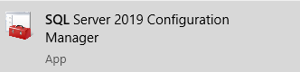
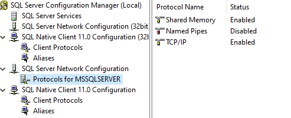
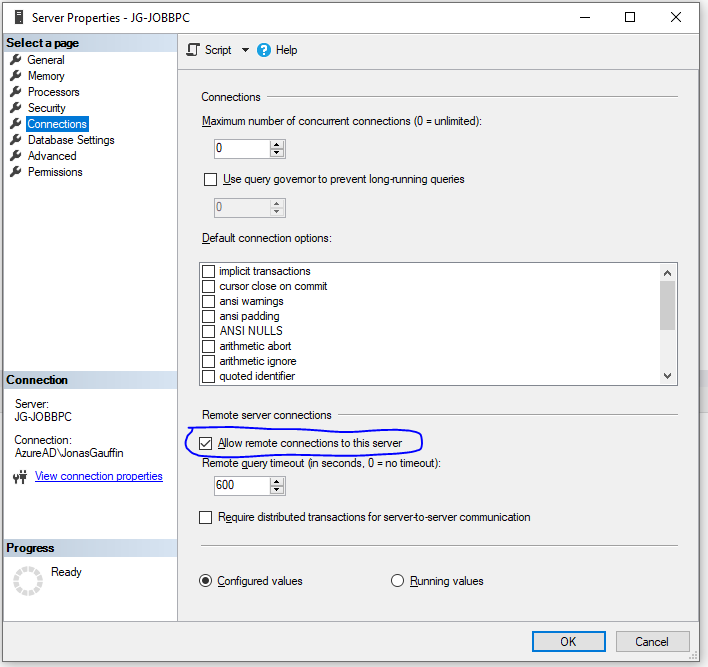
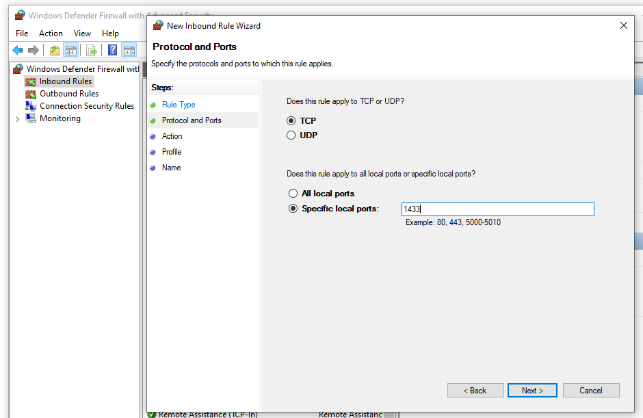

Docker installation
====================

This page will guide you through the installation of the docker image for Coderr Server.

# Prerequisites

Coderr server requires a SQL Server database and a SQL account to be able to connect to it.

Connect to your SQL server using for instance SQL Server Management Studio and open a new query window.

Execute the following SQL:

```sql
create database Coderr;
go
CREATE LOGIN coderr WITH PASSWORD = 'YOUR_PASSWORD_HERE';
ALTER USER coderr WITH DEFAULT_SCHEMA = dbo;
use Coderr
go
exec sp_adduser 'coderr';
EXEC sp_addrolemember N'db_datareader', N'coderr';
EXEC sp_addrolemember N'db_datawriter', N'coderr';
EXEC sp_addrolemember N'db_ddladmin', N'coderr';
```

`ddladmin` is required since Coderr updates the SQL schema every time a new release is made.

## Connecting to SQL Server

To allow a docker container to connect to your SQL Server you must make sure that TCP connectivity is activated.

1. Open SQL Server Configuration manager.<br>
2. Activate TCP/IP<br>
3. Open SQL Server Management studio
4. Right click on your database server and select "Properties"
5. Make sure that remote connections are allowed<br>
6. Restart your SQL server (if configuration changes were needed).
7. Create a new firewall rule (Inbound port rule) to open port 1433<br>


# Installation

Time to install the docker image.

Download our [Docker compose yaml](https://raw.githubusercontent.com/coderrio/Coderr.Server/master/src/DockerCompose/Windows/docker-compose.yml) and adjust it's settings as described by the comments in it.

## Configuration wizard

Coderr will configure itself and create all tables when you run it for the first time.
To get started run docker-compose:

```
docker-compose up coderr-server-web
```

Follow the guide until the setup completes.

Stop the image.

## Running live

Comment out the configuration password in ´Docker-compose.yml` and then run the container again.

```
docker-compose up coderr-server-web
```

Everything should be up and running now.
If not, ask in [our forum](https://discuss.coderr.io).
