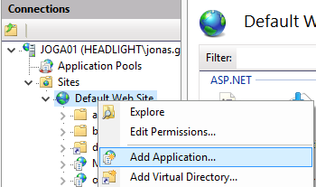
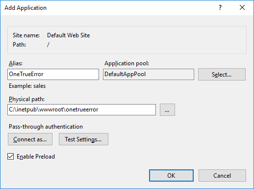

Installation
==============

1. Start by [downloading](https://github.com/coderrapp/codeRR.Server/releases) the latest release.
2. Unzip it
3. Open IIS management console
2. Create a new application in IIS  
  
 
2. Copy the files to the new IIS folder.
6. Open a browser and visit http://yourserver/coderr
7. Follow the online installation guide

## Troubleshooting

Get a blank page from IIS?

* Make sure that "Static Content" is enabled as a feature
* ASP.NET 4.5 must be installed
