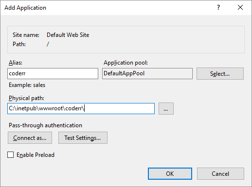

Installation of Coderr Community
=========================

## Prerequisite

Coderr is now built using ASP.NET Core MVC. Make sure that you have installed the .NET Core Hosting Bundle on your web server.

1. Go to https://www.microsoft.com/net/download/all
2. Click on a .NET Core version, for instance <code>.NET Core 2.1</code>
3. Find the **"Runtime & Hosting Bundle"** under "Run apps - Runtime"
4. Download and install it.
5. Stop IIS, run "net stop was /y" from a command prompt
6. Start IIS, run "net start w3svc" from a command prompt.

You can also read [Microsofts guide](https://docs.microsoft.com/en-us/aspnet/core/host-and-deploy/iis/index?tabs=aspnetcore2x&view=aspnetcore-2.1)

## Installation

Instruction for installing Coderr for the first time.

1. Download the installation zip file.
2. Unpack it to a IIS folder (for instance `c:\wwwroot\inetpub\coderr\`).
4. Open IIS management console
5. Create a new application in IIS  
  
 
6. Copy the files to the new IIS folder.

7. Open `appsettings.json` and change `"changeThis"` value to your own installation password.
8. Create a database in your SQL Server (SQL Server 2012 or above).
9. Give the permissions `db_datareader`, `db_datawriter`, `db_ddladmin` to your IIS application pool account (for instance `IIS AppPool\DefaultAppPool`).
10. Open a browser and visit the URL for Coderr
11. Follow the installation guide in the browser

## Upgrading from v1.x 

Upgrade from an earlier version of Coderr.

1. Download the installation zip file.
2. Copy your connection string from `web.config` and store it somewhere.  `<add name="Coderr" connectionString="SAVE THIS STRING ONLY" />`  *(i.e. not the entire XML element but only the attribute contents)*
3. Delete ALL files from your existing Coderr folder.
4. Unpack all files from the zip file to your Coderr folder
5. Open `appsettings.json`
6. Change the connection string to your own.
7. Change `configured` to `true`
8. Close `appsettings.json`
9. Coderr should now work.

## Trouble?

Either write a post in our [Community forum](https://discuss.coderr.io/) or just write us an [email](mailto:help@coderr.io).
