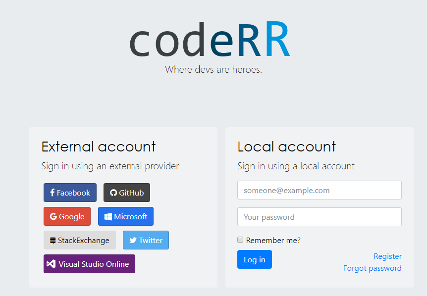
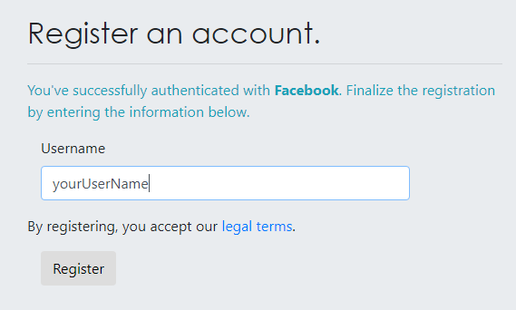
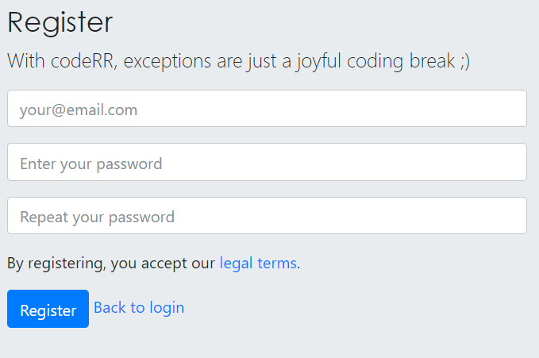
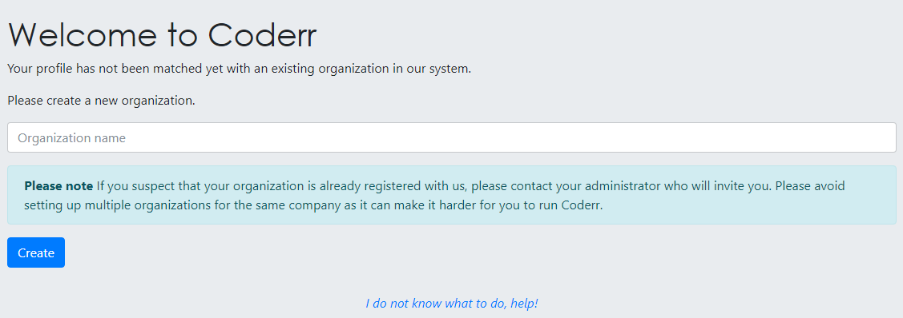
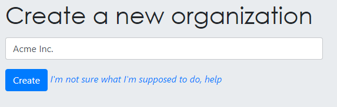
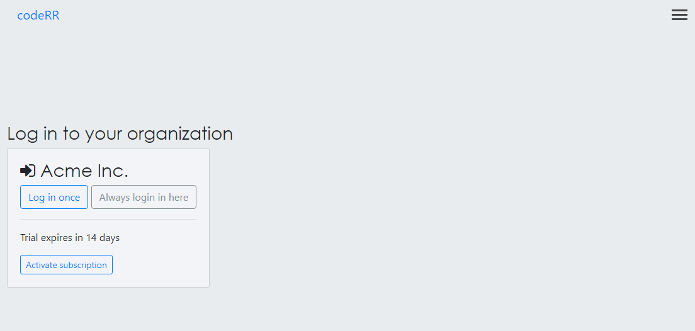
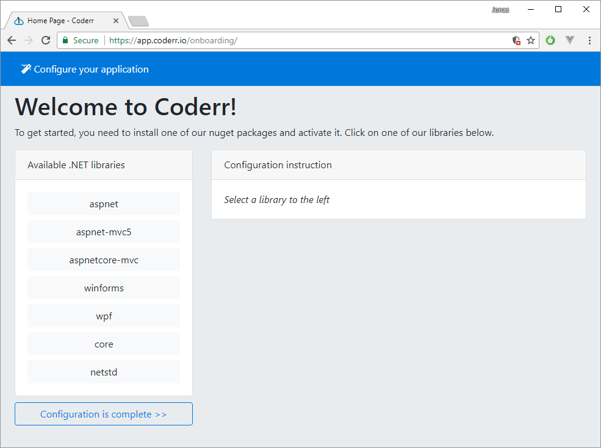
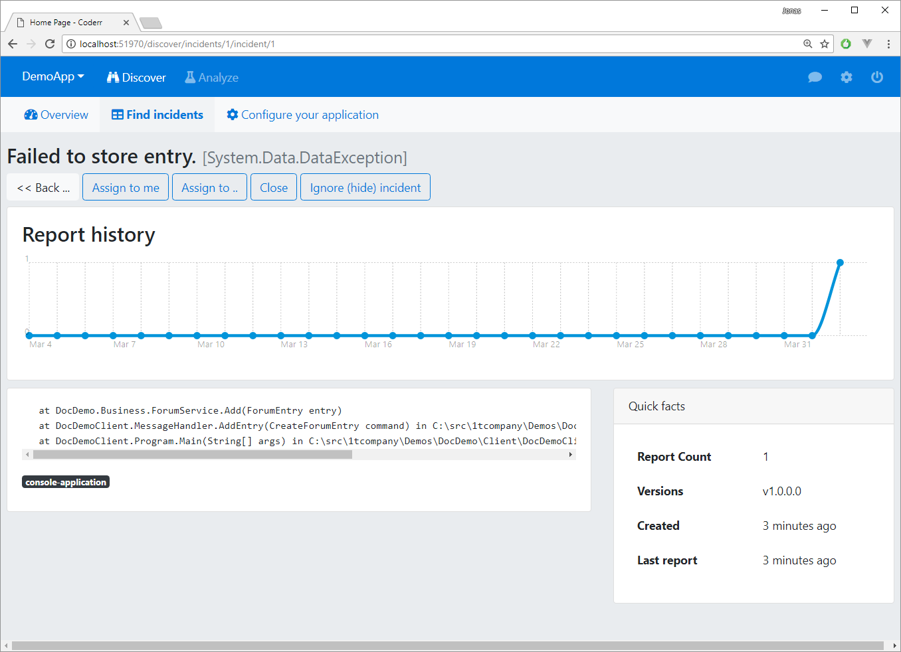

Starting up
===========

Here is a description of the steps you will go through when starting up coderr for the first time. You begin by registering and creating an account followed by logging in and making sure you can see and monitor your application in Coderr. Registering and creating an account only needs to happen once, so the second time you are using Coderr, you will get straight into the log-in page after signing in.

Below you will find a series of instructions and screenshots intended as a guide to have if something goes wrong or you need to pause the process and then return later. If you experience any problems with the process, please email us at help@coderr.io so we can promptly assist you. We might also email you if we notice you have not completed all the steps.

# 1. Registration

You can use either an existing external account (choice on the left) when registering or creating a new account specifically for Coderr (choice to the right). The next time you are using coderr, this will be the view that you will have again, so please remember your sign-in details.

If you are registering using an external provider account (choice to the left) then you will need to finalize your registration in the following window. Note that you can sign in with a different username than what you used for authentication. The user name that you put in will be the one you register. 

If you are creating a new account (the option to the right) and clicked "Register" - in blue, your input is needed to finalize registration in this window:
 
 

# 2. Creating an organizational account

As coderr is intended to be used by organizations with multiple users, you will need to associate your registration with an organization. The future billing is linked to that organization. You either join the already created organization (click "join") or if you are the first from your organization, you will create a new account (click "create").
 

Please note that the only way to join an existing organization is to receive an invitation email from a colleague who set up the organizational account. The "Join" page is just to inform you of that.
 
If you clicked "Create" earlier, you can fill in the name of your organization or company (here shown as the test name "Acme Inc.") and then click "Create" once more to associate your registration with an organization. 

coderr is now setting up your database and your account. 

After successfully creating a new organization, you will receive a welcome email from us, confirming your registration.

# 3. Logging in

If you successfully have completed step 1 and 2 above, then you will reach the "Login"- screen. This is also the view you will see when returning to coderr next time. From here you normally would just be  logging in to the organization that has been associated with you (shown as "mix max" in the example).  However, if you are the first to register your organization and then have administrative privileges, you can log in to any organization where you have these privileges. Here, you can also activate your subscription at any time.

# 4. Creating an application

We have created an application entity for you, to allow you to get started more quickly. You can at a later point change the name of it (using the administration area).

But for you, continue to the next step.

# 5. Configuring your application

Select the correct .NET library or framework that you have used in your application and click "Configure". 

You will now see a set of instructions that you will need to follow. First, ensure you have installed the related nuget package of your chosen .NET library. Next, you'll need to see to that the coderr library knows what server to upload the errors to. 

After adding the lines of code, test your configuration by trying to produce an error manually. 

After successfully generating an error, click on the "Configuration is done" button.

If you failed to upload an error, don't hesitate to [contact us](mailto:help@coderr.io).

# 6.	First error generated

If you have been successful with testing your configuration by generating an exception you will see it here in coderr. Please now go to [Reporting Errors](https://coderr.io/documentation) on our website for more information about how to work with coderr.

 

In case coderr could not detect your attempted exception, please contact us at [help@coderr.io](help@coderr.io) so that we can assist and investigate what went wrong. 
